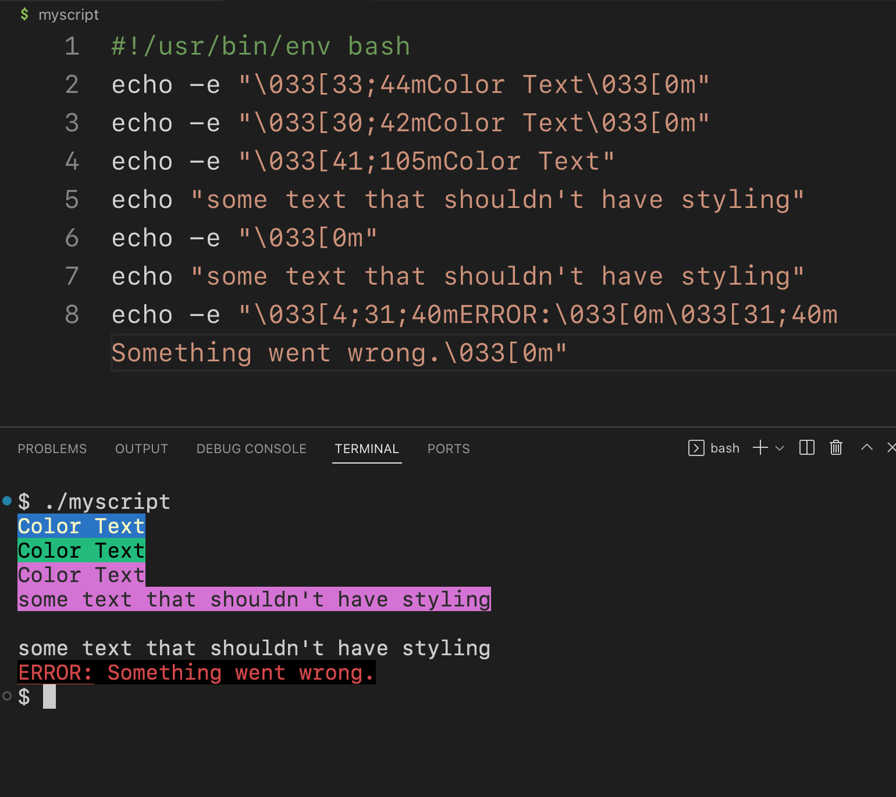
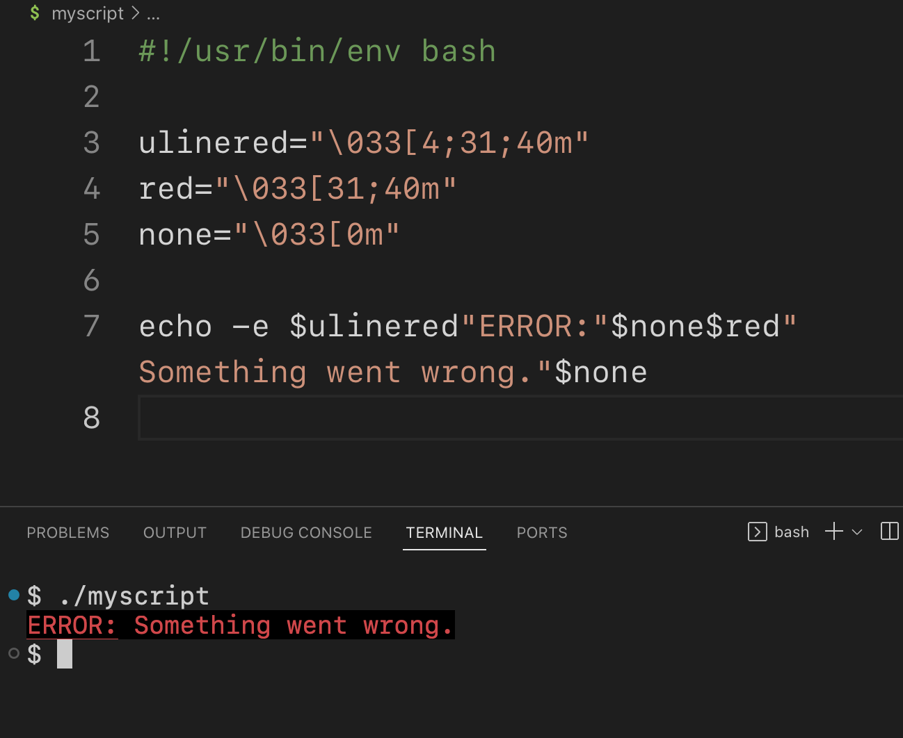
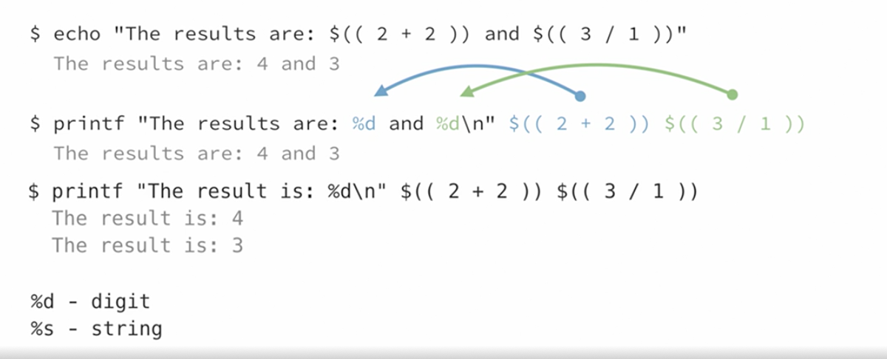
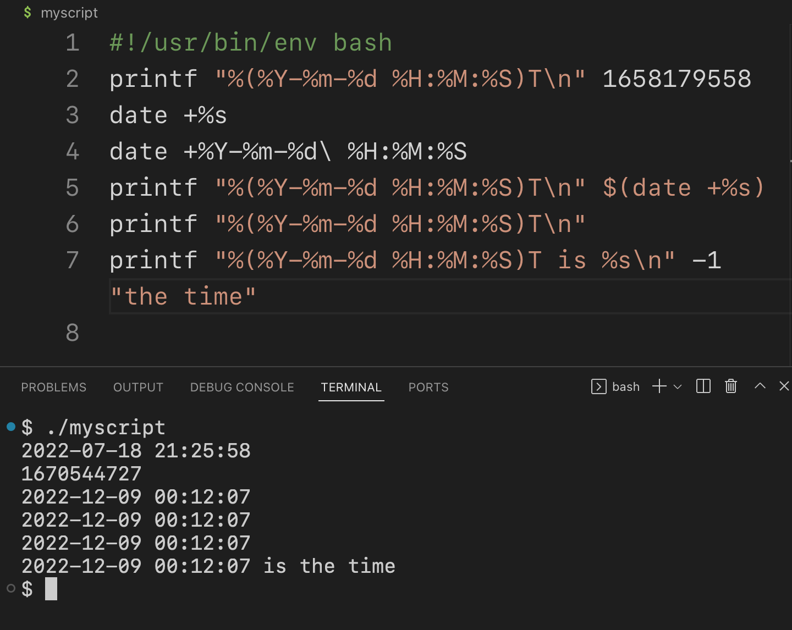
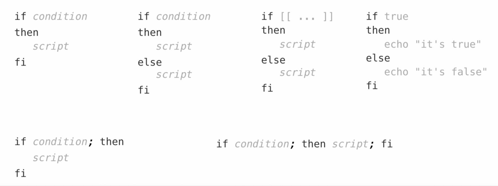

# Learning Bash Scripting
### What is bash?
Bash is a shell, a program lets us interact with a computer giving us access to program, hardware resources and files stored on the system.
Bourne again shell
* Bash is widely used shell, available on many platforms.
* Short for bourne Again Shell, in interference to the earlier Bourne shell.
* An interactive command-line shell that also allows commands to be combined into script files which can be run like programs.
* Combining commands into scripts saves time and reduces errors.
------------------
### What is bash for?
* Bash is best for writing small to medium size scripts that run on Linux systems.
* If your work flow can be run as commands in bash terminal consider making a script.
* If your workflow requires other more specialized tools Bash may not be the best choice for automation.

-----------------
### Where to run Bash ?
Bash is primarily used on Linux system but is available on macOS and Windows system.

Using a Linux system, virtual machine or cloud instance is recommended to learn Bash.

The included version of Bash on macOS is extremely outdated and may be removed in the future.

To run Bash on Windows use GitBash or WSL or Linux VM .

-----------------
### Pipes and Redirection
* **Pipes** send output of one process to another.
* Pipes is very often used with grep, awk, cut and sed command.
````
$ ls | wc -l


$ cat text.txt | less
break output into pagess

$ cat text.txt | wc
    45   1856  12678
count the number of line in this file 

````
* **Redirections** send streams(standard input, output and error) to or from files.
* represented with > or < sign .

|Symbol |Function |
|---|---|
|> | output redirection (turncate ) <br> take whatever redirected and overwrite the contents of destination file  |
|>> |Output redirection (append ) <br> add to the end of the existing file |
|< |Input redirection |
|<< |Here document <br>Allows you to pass multiple lines if input to a command.|
````
$ ls > list.txt 

$ cat << Endoftext
>this is a
>multiline 
>text string 
>Endoftext
this is a 
multiline 
text string 

````
|Stream |Name |Content |
|---|---|---|
|0 |Standard input (stdin) |Keyboard or other input |
|1 |Standard output (stdout ) |Regular output |
|2 |Standard error (stderr) |Output marked as 'error' |

---------------------

### what is bash scripting
#### simple bash script
[Hello World in bash](scripts/first-script.sh)

### Bash built-in and other commands
* Many of the programs we use in Bash are commands.
  * separate software that does not depend on Bash 
* Bash includes built-in commands as well
  * Part of bash itself 
* Some Bash built-ins have the same name as other commands
builtin take precedence on command 
````
$ echo Heloo there 
Hello there 
$ printf hello
hello$

$ command echo hello
hello

$ builtin echo hello
hello

$ command -V name_of_program 
will tell us if the program is builtin or command 

$ enable -n name_of_builtin
to disable specific builtin in session 

$ enable name_of_builtin
to re-enable the builtin again 

````

--------------
### Brackets and Braces in Bash 


### Bash expansions and substitutes 
Expansions and substitutes allows us to specify values that are not known until a script runs.

|Representations | Name |
|---|---|
|~ | Tilde expansion |
|{...} |Brace expansion |
|${...} | Parameter expansion |
|$(...) |Command substitution |
|$((...)) |Arithmetic expansion |

### Tilde expansion ~ 
Tilde expansion represents the user's $HOME environment variable.
````
$ echo ~
/home/username

$ echo ~-
presents the dircetory you were just in 
````

### Brace expansion
* Brace expansion creates sets or ranges. 
* This is written with braces around an expansion.
* Lets us substitute an item from a list of values separated by commas or range of numbers or letters in a given pattern, separated by two dots or periods.
* used when we need to keep part of a path the same but replace a little piece of it.
  * e.g. if we want to create a file inside each of three different directory trees where only part where only part of a path need to change each time.
  * could be used to provide a set of values to use in the same part of a string more generally.
* used working with sequential items .
````
$ echo {1..10}
1 2 3 4 5 6 7 8 9 10

sidradev@Mac-5 java101 % echo {10..1}
10 9 8 7 6 5 4 3 2 1

$ echo {01..100}
001 002 003 004 005 006 007 008 009 010 011 012 013 014 015 016 017 018 019 020 021 022 023 024 025 026 027 028 029 030 031 032 033 034 035 036 037 038 039 040 041 042 043 044 045 046 047 048 049 050 051 052 053 054 055 056 057 058 059 060 061 062 063 064 065 066 067 068 069 070 071 072 073 074 075 076 077 078 079 080 081 082 083 084 085 086 087 088 089 090 091 092 093 094 095 096 097 098 099 100
(number 1 to 100 padded with 0)

$ echo {a..z}
a b c d e f g h i j k l m n o p q r s t u v w x y z

$ echo {Z..A}
Z Y X W V U T S R Q P O N M L K J I H G F E D C B A

$ echo {1..30..3}
1 4 7 10 13 16 19 22 25 28
(every third number between 1 and 30 )

$ echo {a..z..2}
a c e g i k m o q s u w y
(return every other letter between a and z)

$ touch file_{01..12}{a..d}
(create 48 file with sequential name )

 % touch {01..05}{a..c}
 % ls
01a		02c		04b		Bash-101.md	sql-assets
01b		03a		04c		Linux-101.md	sql-learning.md
01c		03b		05a		README.md
02a		03c		05b		learning-vim
02b		04a		05c		scripts


````
------------------
### Parameter expansions ${...}
Parameter expansion retrieve and transforms stored values.
* Sometime can be used without brackets 
* Used to extract sub-strings or manipulating the value of parameter as its being used.
* to replace a particular word or value
* 
````

$ greating="hello there"
$ echo $greating
hello there 

$ echo ${greating:6}
there
(print greating starting from 6th character)

$ echo ${greating:6:3}
the
(print greating starting from 6th character for 3 characters)

% echo ${greating/there/everybody}
hello everybody

 % echo ${greating//e/_}
h_llo th_r_

 % echo ${greating/e/_}
h_llo there
````

-------------------
### Command and substitutions $(...)
* Command substitution puts the output of one command inside another.
* Older representation : `...`
* Bash run the specified command in a subshell and return the output of that into the current command.
* Often used with string manipulation tools to extract part of command's output, such as a file size, an IP address or so on that needed to be handed back to the parent command.

````
 % uname -r
20.6.0

 % echo "the kernel is $(uname -r)."
the kernel is 20.6.0.

 % echo "the python is $(python -V)."
the python is Python 3.9.12.
````

--------------
### Arithmetic expansion $((...))
* Arithmetic expression does calculation.
* Older representation: $[...]
* Bash can use arithmetic expansion to perform arithmetic or calculations and use the result in a command. 

````
$ echo $((2 + 2))
4

$ echo $(( 4 - 4))
2

$ echo $((4 * 5))
20

$ echo $(( 4 / 5 ))
0

````

--------
### Bash Scripts syntax

**One-liners :**
* Many commands presented in one line of text
* Often piped commands or command separated by semicolon.
* Can be very long( and even warp), but there's on newline until the end.
* Often stored in a note for frequent use.

**Bash script :**
* Text file that contains a series of commands
* Bash myscript.sh

**Executable Bash script :**
* Includes a shebang as the first line (#!/usr/bin/env bash)

**Running bash script:**
* Bash script run inside an interactive shell
* You can change options for the subshell with set or shopt on the script.
* Scripts help avoid typos and allow easier sharing of Bash code.

````
$ code myscript
--------------
#!/usr/bin/env bash
echo "hello"

# This is a comment
echo "there"
-------------------
$ chmod +x myscript
$ 
$ ./myscript
hello
there
````
-------------------
### Displaying text with "echo"
* Prints text to standard output.
* Type echo followed by whatever you want to output.
* echo...
* Print text to standard output, we can compose strings and variables and substitution in one echo statement.  

````
$ echo hello
hello
$ echo hello world
hello world
$ 
$ worldsize=big
$ 
$ echo hello $worldsize world
hello big world
$ 
$ echo "The kernel is $(uname -r)."
The kernel is 5.4.0-1094-azure.
$ 
$ echo The kernel is $(uname -r).
The kernel is 5.4.0-1094-azure.
$ 
$ echo the kernel is $(uname -r)
the kernel is 5.4.0-1094-azure
$ 
$ echo the (kernel) is $(uname -r)
bash: syntax error near unexpected token `('
$ echo the \(kernel\) is $(uname -r).
the (kernel) is 5.4.0-1094-azure.
$ 
$ echo 'the kernel is $(uname -r).'
the kernel is $(uname -r).
$ 
$ echo

$ echo;echo "more space!" ;echo

more space!

$ echo -n "no newline"
no newline$ echo -n "part of"; echo -n " a statement"
part of na statement$
````

------------
### working with variables
* Variable allow us to store and retrieve values by name.
* Bash variables are special case of Parameter substitution
* variables are named with alphanumeric characters
* Variable names are case-sensitive 
* For example:mygreeting=Hello
* use a $ sign in front of variable name.
* $variable

````
$ mygreeting=Hello
$ mygreeting2="Good morning!"
$ number=16
$ 
$ echo $mygreeting
Hello
$ 
$ echo $mygreeting2
Good morning!
$ 
$ echo $number
16
$ 
$ declare -r variable=value
(you can not change the variable value later on anywhere)

$declare -l lowerstring="this is some TEXT "
(what ever it gets change it to lower-case)

$declare -u upperstring="This is some TEXT!"
(change to upper case)
````

-------------
### Working with numbers 

**$((...))**
Arithmetic expansion returns the result of mathematical operations.
Older representation : $[...]

**((...))**
Arithmetic evaluation performs calculations and changes the value of variables.

Supported Arithmetic Operations:
|Operation |Operator |
|---|---|
|Addition | + |
|Subtraction | - |
|Multiplication | * |
|Division | / |
|Modulo | % |
|Exponentiation | ** |

Note: Bash only supports integer calculations.

````
$ echo $((4+4))
8

$ echo $((8-5))
3
$ echo $((2*3))
6
$ echo $((8/4))
2

 echo $(( (3+6) - 5 * (5*2) ))
-41
$ 
$ a=3
$ ((a+=3))
$ echo a
a
$ echo $a
6
$ ((a++))
$ echo $a
7
$ ((a++))
$ echo $a
8
$ ((a--))
$ echo $a
7
$ ((a+=2))
$ echo $a
9
$ ((a-=3))
$ echo $a
6
$ ((a*=2))
$ echo $a
12
$ ((a/=2))
$ echo $a
6
$ 
$ b=5
$ echo $b
5
$ b=$b+2
$ echo $b
5+2
$ #treats it like a string
$ #so we need to declare it as interger 
$ 
$ declare -i b=3
$ echo $b
3
$ b=$b+4
$ 
$ echo $((1/3))
0
## will give the result in whole number 
## to do more precise calculations consider bc or awk
````
````
$ declare -i c=1
$ declare -i d=3
$ declare -i b=3

$ e=$(echo "scale=3; $c/$d" | bc)
$ echo $e
.333
$ #this response is treated by bash as text by bash 
$ 
$ #random
$ echo $RANDOM
29887
$ echo $RANDOM
22800
$ echo $RANDOM
22357
$ 
$ echo $(( 1+ RANDOM % 10))
8

$ echo $(( 1+ RANDOM % 10))
9

````

---------------------------------------
### [...]
#### Comparing values with test 

" [" is an alias for the test built-in and is used to test or evaluate expressions.


**Exit or Return Status:**
* The shell returns a status code after a command completes
* 0 means success.
* 1 means failure.
* 0 and 1 can be treated as truth values ( 0= true , 1= false )
* With truth values we can apply logic to our scripts 
* The return status is treated as the value of the command.

````
$ [ -d ~ ]
$ echo $?
0
$ [ -d /bin/bash ]; echo $?
1
$ [ -d /bin ]; echo $?
0
$ [ "cat" = "dog" ]; echo $?
1
$ [ "cat" = "cat" ]; echo $?
0

$ [ 4 -lt 5 ]; echo $?
0
$ [ 4 -lt 5 ]; echo $?
0
$ [ 4 -lt 3 ]; echo $?
1
$ [ ! 4 -lt 5 ]; echo $?
1
$ [ ! 4 -lt 3 ]; echo $?
0
````
---------------------------------
### [[...]]
#### Comparing values with extended test

* Extended test supports comparisons that test runs and add other features.
* Extended test offers more features
* Test is more widely used with other shells.
* we can use more than one expression with in a text to create a little more complex logic.

**Regular expressions:**
A regular expression (regex) is a text pattern that can be used for searching and replacing. Regular expressions are similar to Unix wild cards used in globbing, but much more powerful, and can be used to search, replace and validate text.

````
$ [[ 4 -lt 3 ]];echo $?
1
$ [[ -d ~ && -a /bin/bash ]]; echo $?
0
$ [[ -d ~ && -a /bin/mash ]]; echo $?
1
$ [[ -d ~ || -a /bin/mash ]]; echo $?
0
$ [[ -d ~ ]] && echo ~ is a directory
/home/codespace is a directory
$ [[ -d /bin/bash ]] && echo /echo /bin/bash is a directory
$ l && echo "listed the directory"
CONTRIBUTING.md  dir3/      myscript*  Snippets.md
dir1/            LICENSE    NOTICE     Solutions/
dir2/            lorem.txt  README.md
listed the directory
$ true && echo "success!"
success!
$ false && echo "success"

$ [[ "cat" =~ c.* ]]; echo $?
0
$ [[ "bat" =~ c.* ]]; echo $?
1
````

----------------------------------------------------------------------


### Formatting and styling text output 
### echo -e ...
Interprets escaped characters like \t, \n, \a and other control characters.

````
$ echo -e "Name\t\tNumber"; echo -e "Sid\t\t123"
Name            Number
Sid             123
$ echo -e "This text\nbreaks over\nthree lines"
This text
breaks over
three lines
$ echo -e "\a"

````
````
# text formating instructions:
# in myscript;
         "\foreground[backgroundm
````



#### Common Terminal colors and Styles

|Color |FG |BG |
|---|---|---|
|Black |30 |40|
|RED |31 |41 |
|Green |32 |42 |
|Yellow |33 |43 |
|Blue |34 | 44 |
|Magenta |35 |45 |
|Cyan |36 |46 |
|White |37 |47 |

|Color |FG |BG |
|---|---|---|
|Bright Black |90 |100|
|Bright RED |91 |101 |
|Bright Green |92 |102 |
|Bright Yellow |93 |103 |
|Bright Blue |94 | 104 |
|Bright Magenta |95 |105 |
|Bright Cyan |96 |106 |
|Bright White |97 |107 |

|Style | |
|---|---|
|Reset | 0 |
|Bright | 1 |
|Dim  |2 |
|Italic |3|
|Underlined |4 |
|Blinking |5|
|Inverted |7 |
|Strikethrough |9 |

------------------------------------------------

### printf "..."
Outputs text using placeholders and formatting 

**Using Placeholders with Printf :**


````
# myscript:
 
echo "----10----| --5--"

echo "Right-aligned text and digits"
printf "%10s: %5d\n" "A Label" 123 "B Label" 456

echo "Left-aligned text, right-aligned digits"
printf "%-10s: %5d\n" "A Label" 123 "B Label" 456

echo "Left-aligned text and digits"
printf "%-10s: %-5d\n" "A Label" 123 "B Label" 456

echo "Left-aligned text, right-aligned and padded digits"
printf "%-10s: %05d\n" "A Label" 123 "B Label" 456

echo "----10----| --5--"

--------------------------------------
#terminal 

$ ./myscript
----10----| --5--
Right-aligned text and digits
   A Label:   123
   B Label:   456
Left-aligned text, right-aligned digits
A Label   :   123
B Label   :   456
Left-aligned text and digits
A Label   : 123  
B Label   : 456  
Left-aligned text, right-aligned and padded digits
A Label   : 00123
B Label   : 00456
----10----| --5--
$ 

````


------------------------
### Arrays in Bash
Array let sus store multiple values .

Bash supports two types of array:
1. Indexed 
2. Associated arrays


````
$ declare -a snacks=("apple" "banana" "orange")

$ echo ${snacks[2]}
orange

$ snacks[5]="grapes"
$ snacks+=("mango")

$ echo ${snacks[@]}
apple banana orange grapes mango
$ 
$ for i in {0..6}; do echo "$i: ${snacks[$i]}"; done
0: apple
1: banana
2: orange
3: 
4: 
5: grapes
6: mango
````
````
$ declare -A office
$ office[city]="Hamilton"
$ office["building name"]="HQ West"

$ echo ${office["building name"]}
HQ West

$ echo ${office["building name"]} is in ${office[city]}
HQ West is in Hamilton
$ 
````
-----------------------
### Conditional statements with the "if" keyword 
````
if ...
then
  ...
fi
````
If statement execute code based on a conditional expression.

**Control structure in Bash:**
* Allow us to control how script execution happens 
* Run specifies code based on conditions



````
#script

declare -i a=3

if [[ $a -gt 4 ]]; then
    echo "$a is greater than 4!"
else
    echo "$a is not greater than 4!"
fi

--------------
# terminal

$ ./myscript
3 is not greater than 4!
$ 
````
````
# script

declare -i a=3

if [[ $a -gt 4 ]]; then
    echo "$a is greater than 4!"
elif (( $a > 2 )); then
    echo "$a is greater than 2."
else
    echo "$a is not greater than 4!"
fi

-----------------------
#terminal

$ ./myscript
3 is greater than 2.
$ 

````

-------------------
### while loop

1. While loops run as long as their condition is true.
````
While ....
do
  ...
done
````

2. Until loops run as long as their condition is false.
````
until ...
do
  ...
done
````
Example:
````
#script

declare -i n=0
while (( n < 9 ))
do
    echo "n:$n"
    ((n++))
done

-----------------------------------------
#terminal

$ ./myscript
n:0
n:1
n:2
n:3
n:4
n:5
n:6
n:7
n:8

````
````
#script

declare -i n=0
until (( n == 11 ))
do 
    echo "n:$n"
    ((n++))
done

------------------
#terminal

$ ./myscript
n:0
n:1
n:2
n:3
n:4
n:5
n:6
n:7
n:8
n:9
n:10
````

----------------
### for loop
For loops iterate through a list of items, running code once for each item.
````
for i in ....
do
  ...
done
````
Examples:
````
for i in 1 2 3 4
do
    echo $i
done
-------------
 ./myscript
1
2
3
4
````
````
for i in {1..10}
do
    echo $i
done
-------------
$ ./myscript
1
2
3
4
5
6
7
8
9
10
````
````
for (( i=1; i<=5; i++ ))
do
    echo $i
done
-------------
$ ./myscript
1
2
3
4
5
````
````
#!/usr/bin/env bash
declare -a fruits=("apple" "banana" "plum")
for i in ${fruits[@]}
do
    echo $i
done
-------
$ ./myscript
apple
banana
plum
````
````
declare -A arr
arr["Name"]="Usman"
arr["id"]="6075"
for i in "${!arr[@]}"
do
    echo $i: "${arr[$i]}"
done
------
$ ./myscript
id: 6075
Name: Usman
````
````
for i in $(ls)
do
    echo "Found a file: $i"
done
------
$ ./myscript
Found a file: CONTRIBUTING.md
Found a file: dir1
Found a file: dir2
Found a file: dir3
Found a file: LICENSE
Found a file: lorem.txt
Found a file: myscript
Found a file: NOTICE
Found a file: README.md
Found a file: Snippets.md
Found a file: Solutions
````
````
for i in *
do
    echo "Found a file: $i"
done
--------------------------------------
$ ./myscript
Found a file: CONTRIBUTING.md
Found a file: dir1
Found a file: dir2
Found a file: dir3
Found a file: LICENSE
Found a file: lorem.txt
Found a file: myscript
Found a file: NOTICE
Found a file: README.md
Found a file: Snippets.md
Found a file: Solutions
````

-------------------
### case
* Checks an input against a set of predefined values.
* Runs code when an input matches a condition.
````
animal="dog"
case $animal in 
    bird) echo "Avian";;
    dog|puppy) echo "Canine";;
    *) echo "No match";;
esac
----------------
$ ./myscript
Canine
$ 
````
````
animal="elephant"
case $animal in 
    bird) echo "Avian";;
    dog|puppy) echo "Canine";;
    *) echo "No match";;
esac
-----------------------------
$ ./myscript
No match
````


--------------------
### Functions fname()
* Functions allow us to repeatedly call a piece of code.
* Older version: function fname {...}
* Functions need to be declared before their use.
* Function Variables
  * $@ : Represent the list of arguments given to a function
  * $FUNCNAME represent the name of a function.

````
fname() {
  ...
}
````
````
greet(){
    echo "Hello there!"
}

echo "And now, a greeting"
greet
-------------
$ ./myscript
And now, a greeting
Hello there!
````
**Adding 1st argument with $1**
````
greet() {
    echo "Hi there, $1"
}

echo "And now, a greeting..."
greet SID 
------------
$ ./myscript
And now, a greeting...
Hi there, SID
````
**Passing 2 arguments in a function:**
````

greet() {
    echo "Hi there, $1. What a nice $2"
}

echo "And now, a greeting..."
greet SID afternoon
greet Usman evening!
--------------------------------------------
$ ./myscript
And now, a greeting...
Hi there, SID. What a nice afternoon
Hi there, Usman. What a nice evening!
$ 
````
````
numberthing() {
    declare -i i=1
    for f in $@; do
        echo "$i: $f"
        (( i += 1 ))
    done
    echo "This counting was brought to you by $FUNCNAME."
}

numberthing "$(ls /)"
echo
numberthing pine birch maple spruce
------------------------------------------------
$ ./myscript
1: bin
2: boot
3: dev
4: etc
5: get-pip.py
6: go
7: home
8: lib
9: lib32
10: lib64
11: libx32
12: media
13: mnt
14: opt
15: proc
16: root
17: run
18: sbin
19: srv
20: sys
21: tmp
22: usr
23: var
24: vscode
25: workspaces
This counting was brought to you by numberthing.

1: pine
2: birch
3: maple
4: spruce
This counting was brought to you by numberthing.
$ 
````
**Local variable:**
````
var1="I'm variable 1"

myfunction() {
    var2="I'm variable 2"
    local var3="I'm variable 3"
}
myfunction

echo $var1
echo $var2
echo $var3
-------------------
$ ./myscript
I'm variable 1
I'm variable 2
````

-------------------
### Reading and Writing text files
* Write files with output redirection oeperators (> and >>)
  * echo "abc" > out.txt overwrites the contents of out.txt
  * echo "abc" >> out.txt appends to the end of out.txt
* Reading from file with input redirection(<) and read command
  * while read line; do echo $line; done < in.txt


  
**Write a file:**
````
for i in 1 2 3 4 5
do
    echo "This is line $i" > ~/textfile.txt
done
---------------
$ ./myscript
This is line 1 > ~/textfile.txt
This is line 2 > ~/textfile.txt
This is line 3 > ~/textfile.txt
This is line 4 > ~/textfile.txt
This is line 5 > ~/textfile.txt
$ 
````
````
for i in 1 2 3 4 5
do
    echo "This is line $i" > textfile.txt 
done
--------------
$ ./myscript
$ cat textfile.txt
This is line 5
````

````
$ rm textfile.txt
---------------
for i in 1 2 3 4 5
do
    echo "This is line $i" >> textfile.txt 
done
-------------------------
$ ./myscript

$ cat textfile.txt
This is line 1
This is line 2
This is line 3
This is line 4
This is line 5
$ 
````
**Read a file:**
````
while read f
    do echo "I read a line an it says: $f"
done < textfile.txt
----------------
$ ./myscript
I read a line and it says: This is line 1
I read a line and it says: This is line 2
I read a line and it says: This is line 3
I read a line and it says: This is line 4
I read a line and it says: This is line 5

````

---------------
### Arguments
**Arguments in BAsh Scripting:**
* Allow us to pass information into a script from the CLI
* Arguments are text that represented by a string, a filename and so on.
* Arguments are represented by numbered variables ($1, $2 ,...)

````
echo "The $0 script got the argument: $1"
echo "Argument 2 is: $2"
----------
$ ./myscript Apple
The ./myscript script got the argument: Apple
$ ./myscript Apple Orange
The ./myscript script got the argument: Apple
Argument 2 is: Orange
$ ./myscript Apple Pie
The ./myscript script got the argument: Apple
Argument 2 is: Pie
$ 
````
````
for i in "$@"
do 
    echo $i
done

echo "there are $# arguments "
------------
$ ./myscript dog cat "blue river" bird 
dog
cat
blue river
bird
there are 4 arguments 
$ 
````


------------
### Options in Bash Scripting
* Allow us to pass information into a script from the CLI
* Are a combination of a dash and a  letter (like -u or -p)
* Are accessed using the "getopts" keyword
* Can accept arguments of their own
* Can be specified and used in any order

````
while getopts u:p: option; do
    case $option in
        u) user=$OPTARG;;
        p) pass=$OPTARG;;
    esac
done

echo "user: $user / pass: $pass"
--------------------------------------
$ ./myscript -u usman -p jehdebd
user: usman / pass: jehdebd
$ 
````
````
while getopts u:p:ab option; do
    case $option in
        u) user=$OPTARG;;
        p) pass=$OPTARG;;
        a) echo "got the A flag";;
        b) echo "got the B flag";;
    esac
done

echo "user: $user / pass: $pass"
--------------------------------
$ ./myscript -u SID -p jhdjhd
user: SID / pass: jhdjhd
$ ./myscript -u SID -p jhdjhd -a 
got the A flag
user: SID / pass: jhdjhd
$ ./myscript -u SID -p jhdjhd -ab
got the A flag
got the B flag
user: SID / pass: jhdjhd
$ 
````
````
while getopts :u:p:ab option; do
    case $option in
        u) user=$OPTARG;;
        p) pass=$OPTARG;;
        a) echo "got the A flag";;
        b) echo "got the B flag";;
        ?) echo "I don't know what that $OPTARG is"
    esac
done

echo "user: $user / pass: $pass"

---------------
$ ./myscript -u SID -p jhdjhd -abc
got the A flag
got the B flag
I don't know what that c is
user: SID / pass: jhdjhd
$ 
````

-------------------
### Getting input during execution
**Gathering input Interactively :**
* Scripts often need input as they run 
* The read keyword allows us to gather input, passing the script until input is provided.
* Input is stored in a variable.


````
echo "What is your name?"
read name 

echo "What is your Password?"
read -s pass 

read -p "What is your favorite animal?  " animal

echo name: $name, pass: $pass, animal: $animal
----------------------------------------------------
$ ./myscript
What is your name?
Sid
What is your Password?
What is your favorite animal?  cat
name: Sid, pass: asdf, animal: cat
$ 

````

````
select animal in "bird" "dog" "fish"
do 
    echo "you selected $animal"
    break
done
--------------------------------------
$ ./myscript
1) bird
2) dog
3) fish
#? 2
you selected dog
$ 

````
````
select animal in "bird" "dog" "fish" "quit"
do 
    case $animal in 
        bird) echo "Birds like to fly.";;
        dog) echo "Dogs like to catch.";;
        fish) echo "Fish like to swim.";;
        quit) break;;
        *) echo "I am not sure what that is !"
    esac
done
---------------------------------------------
$ ./myscript
1) bird
2) dog
3) fish
4) quit
#? 2
Dogs like to catch.
#? 1
Birds like to fly.
#? 3
Fish like to swim.
#? 8
I am not sure what that is !
#? 4
$ 
````
------------------
### Ensuring a response
User ignoring input prompts causes problem.
There are few ways to deal with it
1. Using -i option and suggesting a response.
````
read -ep "Favorite color? " -i "Blue" favcolor
echo $favcolor
--------------------------
$ ./myscript
Favorite color?Blue
Blue
$ ./myscript
Favorite color? red
red
$ 

````
2. Using # sign variable .
````
if (($#<3)); then
    echo "This command requires three arguments:"
    echo "username, userid, and favorite number."
else
    # the program goes here
    echo "username: $1"
    echo "userid: $2"
    echo "favorite number: $3"
fi
-------------------------
$ ./myscript SID
This command requires three arguments:
username, userid, and favorite number.
$ ./myscript SID 456 8
username: SID
userid: 456
favorite number: 8
$ 

````
3. Setting up a loop.
````
read -p "Favorite animal? " fav
while [[ -z $fav ]]
do
        read -p "I need an answer! " fav
done

echo "$fav was selected."
---------------------------
$ ./myscript
Favorite animal? 
I need an answer! cat
cat was selected.
$ 

````
4. using read and if command .
````
read -p "Favorite animal? " fav
if [[ -z $fav ]]; then
    fav="cat"
fi
echo "$fav was selected"

-------------------
$ ./myscript
Favorite animal? dog
dog was selected
$ ./myscript
Favorite animal? 
cat was selected
$ 
````


5. rejecting input that doesnt not pass avaluation :
````
read -p "What year? [nnnn] " year
until [[ $year =~ [0-9]{4} ]]; do
        read -p "A year, please! [nnnn] " year
done
echo "Selected year: $year"
------------------
$ ./myscript
What year? [nnnn] 99
A year, please! [nnnn] 1991
Selected year: 1991
````

-----------------------

|Command | Description  |
|---|---|
|bash --version |Shows us which version of bash is installed |
|echo $SHELL | TO check the default shell |
|command -V name_of_program |will tell us if the program is builtin or command |
|enable -n name_of_builtin|to disable specific builtin in session |
|enable name_of_builtin |to re-enable the builtin again |
|help |list of all built-in |
|help name_of_builtin |for info for that built-in |
|echo ~- |old pwd |