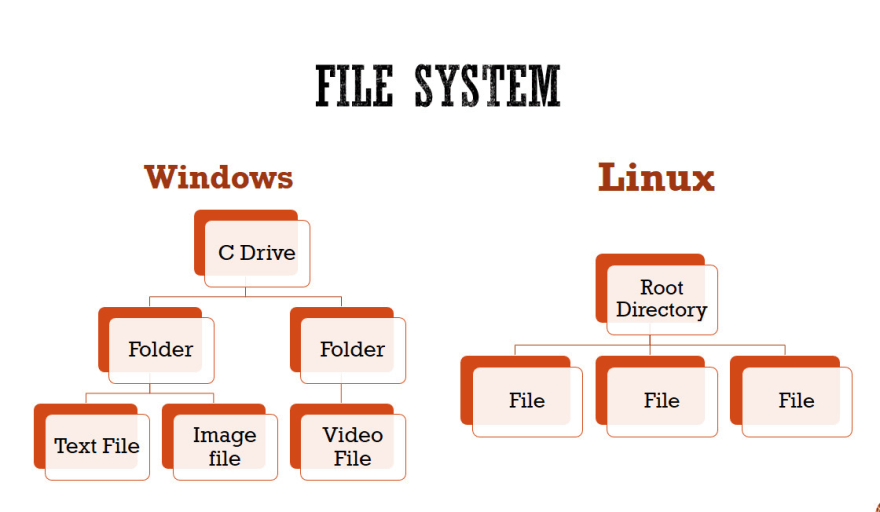

## Linux Command Line

-----------------
### Introduction 
Linux broadly refers to a free, open source operating system.
just another name for kernel. A kernel allows software to communicate with a computer's hardware.
Linux was inspired by MINIX which was inspired by Unix. Linux is free software under the GPL(GNU General Public License).

------------------

### Linux Tools and Distributions
* All linux system run a version of the Linux kernel.
* Most Linux systems use the same set of core tools called the GNU coreutils.
* Linux distributions are operating systems that include the kernel and various other pieces of software.
* Distribution maintainer make choices about how their distributions are configured and what tools they provide.
  
    **Common Distribution Families:**
  Many distributions are related to each other and all distributions differ in various ways.
  The command line or shell is common to all of them.(Bash shell is used widely) 
  * Arch 
  * Debian 
  * Red Hat 
  * Slackware

----------------------

### What is Command Line?
The command line interpreter or Command-line processor uses a command-line interface(CLI) to receive commands from a user in the form of lines of text.

Command-line also called Windows command-line, command screen or text-interface that navigate by typing commands at prompts instead of using a mouse.
command-line programs can read text inputs and output text to the screen.
command-line programs can read and write from files and network.

----------------------------

### What is Bash?
Bash is a widely used shell or command-line interpreter.

**Using a terminal:**
We use a shell like bash through a terminal application either in full screen mode or as windows in a graphical environment.
we can use graphical and text base interface at the same time and even open more than one terminal window at the same time to perform different tasks.

-------------------------

### Terminal terms:
* Command-line interface(CLI) is any place we can enter text commands.
* A shell is a piece of software that interprets typed commands and runs them.
* Terminal is software that a shell program runs inside of.

-----------------

### General Command Syntax:
In writing commands
* There will always be a command.
* There may be one or more options.
    Option may accept arguments.
* There may be one or more arguments.

````
Example:

ls -lh /usr/bin
sort -u user.text
grep -i "needle" haystack

In which there are three parts 
command    option(s)   argument(s)
ls          -lh         /usr/bin
sort        -u          user.tex
grep        -i"needle"  haystack

````
### Commands :
* Commands are programs that are available on a system.
* When we run a command, the system takes a specific action.
* many commands have short names in order to save typing.e.g ls,du,cat.

### Options :
* Options tell a command how to operate.
* Options often begin with a dash or minus sign e.g. -e  or -s .
* Options are often represented by one letter or number.
* Most commands offer more than one option.
* Options can be used together. e.g. 
```` 
$ ls -l 
$ ls -l -a -h 
$ ls -l -a 
$ ls -lhl
$ ls --group-drirectories-first --human-readable

````

### Arguments :
* **Arguments tell the command what to operate on**.
* it is usually a file, path, set of files or directories separated by spaces.
* An argument can also be a string of text or something else.
````
$ sort -u user.text
````

--------------------------------

### Troubleshooting Commands
* Spacing matters 
* Spelling of Command name matters
* Misspelled commands usually will just fail
* Mistyped options or arguments can cause unexpected outcomes or data loss.
* Always double-check what you have typed before running it.

### What commands can be used 
* Most commands are programs installed on the system
* Many common utilities come from the GNU coreutils.
* The system provides ways for us to find programs


|Command	|Usage |
|---|---|
|ls	|Lists the content of a directory|
|alias	|Define or display aliases|
|unalias|	Remove alias definitions|
|pwd	|Prints the working directory|
|cd	|Changes directory|
|cp	|Copies files and directories|
|rm	|Remove files and directories|
|mv	|Moves (renames) files and directories|
|mkdir	|Creates directories|
|man	|Displays manual page of other commands|
|touch	|Creates empty files
|chmod	|Changes file permissions|
|./	|Runs an executable|
|exit|	Exits the current shell session|
|sudo|	Executes commands as superuser|
|shutdown	|Shutdowns your machine|
|htop	|Displays processes and resources information|
|unzip|	Extracts compressed ZIP files|
|apt, yum, pacman	|Package managers|
|echo	|Displays lines of text|
|cat	|Prints file contents|
|ps	|Reports shell processes status|
|kill	|Terminates programs|
|ping	|Tests network connectivity|
|vim|	Efficient text editing|
|history	|Shows a list of previous commands|
|passwd	|Changes user password|
|which	|Returns the full binary path of a program|
|shred	|Overwrites a file to hide its contents|
|less|	Inspects files interactively|
|tail	|Displays last lines of a file|
|head	|Displays first lines of a file|
|grep	|Prints lines that match patterns|
|whoami|	Outputs username|
|whatis|	Shows single-line descriptions|
|wc	|Word count files|
|uname	|Displays OS information|
|neofetch	|Displays OS and hardware information|
|find	|Searches for files that follow a pattern|
|wget	|Retrieves files from the internet|

-------------------------

## Finding help for commands 

### **man** Command for Manual pages:
* The command man opens the manual pages.
* Manual pages are the built-in documentation for commands

````
man command name 
e.g.
username ~$ man ls
checking the man pages for ls command 

````

### help command 
Give the brief info and lead to man pages
syntax:
````
username ~$ command --help

username ~$ help
(list commands with syntax for bash specific commands)
 
username ~$ ls --help
````
### apropos command 
if we don't know the name of command we use apropos with text as argument and see description for number of results.
````
username ~$ apropos text

e.g.
username ~$ apropos list
````

### Useful Keyboard Shortcuts
**1. Tab completion:**
  * Automatically complete a file or folder name.
  * Make guesses based on the contents of the path.

**2. Text navigation shortcuts:**
  
|Key Combination |Result |
|---|---|
|Ctrl-A(^A)  |Move to beginning of the line |
|Ctrl-E(^E)  |Move to end of line <br> (A **line** is any text we type at the command prompt before pressing **return** )|
|Ctrl-U |Delete from cursor to line start |
|Ctrl-K |Delete from cursor to line end |
|Ctrl-Shift-c |Copy selected text to clipboard |
|Ctrl-Shift-V |Paste text from clipboard |
|UP arrow |Recall previous command |
|Down arrow | Scroll previous command |
|Ctrl-R |Search command history |
|Ctrl-C |Cancel command |

-----------------------

### The Linux file system 
Linux file system is generally a built-in layers of a linux operating system used to handle the data management of the storage. <br>It helps to arrange the file on the disk storage. It manages the file name, file size, creation date and much more information about a file.

<br>A Linux file system is a structured collection of files on a drive or a partition. A partition is a segment of memory and contains some specific data. In our machine there can be various partitions of the memory. Generally, every partition contains a file system.<br>

The Linux file system follows a tree-like hierarchical structure starting at the root. It consists of **directories, sub-directories and data files**. This structure follows a standard layout recommended by Filesystem Hierarchy Standard(FHS), which is standard maintained by the Linux Foundation.




### How directories are organized
* We need to know where files and commands can be found
* The file system keeps track of and represents file on the  system's storage.
* Filesystem Hierarchy Standard(FSH) defines common locations for files across many Linux distributions.

### Notable File System Directories 
* File System root: /
  * Contains all other directories 
  * Highest level of the file system hierarchy 
* User home directories: /home
  * Location where each user's personnel files are stored.
  * Each user has their own directory within /home/
  * In Bash and many other shells each user's own home directory is represented by tilda(~) character.
  * On desktop distros the home directory often contains subdirectories like Documents, Downloads and Pictures. 
* Root user home directory:/root
  * The root user's home directory is /home/root on some select distributions but you'l usually see it positiones at /root right in the top level of the beginning of the file stricture.
* Common configuration files: /etc 
* Common programs or commands: /bin, /sbin
* Shared libraries and modules: /lib
* Standard location for mounting other file systems: /mnt, /media 
* Kernel and system information: /dev, /proc, /sys

--------------

### Commands for File Information
1. file - determine file type
2. stat - display file status 

Example:

````
$ file Documents
Documents: directory 

$ file file.c file /dev/{wd0a,hda}
           file.c:   C program text
           file:     ELF 32-bit LSB executable, Intel 80386, version 1 (SYSV),
                     dynamically linked (uses shared libs), stripped
           /dev/wd0a: block special (0/0)
           /dev/hda: block special (3/0)
           
````
````
$ stat Documents
````
--------------------
### Paths on Linux 
* A path represents the location of a file or directory.
* Paths use the slash character(/) as a separator between directory or file names.
* Paths can be absolute or relative.

### Absolute Paths
* Begins from the root of the file system 
* Defines an explicit location on the file system 
````
        /home/sid/
        /home/sid/Documents
   (A Slash at the beginning indicates an absolute path) 
````
### Relative Paths 
* Begin from the current working directory 
* If the current working directory changes, what the path refers to changes 
````
  Working Directory       Relative Path      Resulting Absolute Path   
  /home/sid               Documents           /home/sid/Documents
  /home/youruser          Documents           /home/youruser/Documents  
  
  (NO SLASH AT THE BEGINNING OF THE RELATIVE PATH)
 ````
* The name ".." refers to the parent directory of the current working directory.
````
  Working Directory       Relative Path      Resulting Absolute Path   
  /home/sid               ..                 /home
  /home/sid/Documents     ..                 /home/sid 
  /home/sid/Pictures      ../Documents       /home/sid/Documents

````

### Tilde Expansion
* The tilde character (~) refers to the current user's home directory.
* My documents are at the path ~/ Documents
* The shell expands the character ~ to the path of the user's home directory.
````
      ~/Documents ->  /home/sid/Documents
      ~/Documents ->  /home/username/Documents   
````

-------------------------
### cd 
The cd command can be used to change into a subdirectory, move back into the parent directory, move all the way back to the root directory or move to any given directory.


when there space in arguments, we will the error of "too many arguments" , to avoide that we have to tell Bash  that this space is part of the path not a seprator between two arguments or commands.
There are two ways to do that:
1. Put the path inside double quotes.
2. Type a back-slash in front of space know that,escaping a character means it will be treated literally instead of any other special meaning.<br> If we have two spaces in there we need to escape each space character individually.
3. 

|Command	|Usage |
|---|---|
|ls	|Lists the content of a directory|
|alias	|Define or display aliases|
|unalias|	Remove alias definitions|
|pwd	|Prints the working directory|
|cd	|Changes directory|
|cp	|Copies files and directories|
|rm	|Remove files and directories|
|mv	|Moves (renames) files and directories|
|mkdir	|Creates directories|
|man	|Displays manual page of other commands|
|touch	|Creates empty files
|chmod	|Changes file permissions|
|./	|Runs an executable|
|exit|	Exits the current shell session|
|sudo|	Executes commands as superuser|
|shutdown	|Shutdowns your machine|
|htop	|Displays processes and resources information|
|unzip|	Extracts compressed ZIP files|
|apt, yum, pacman	|Package managers|
|echo	|Displays lines of text|
|cat	|Prints file contents|
|ps	|Reports shell processes status|
|kill	|Terminates programs|
|ping	|Tests network connectivity|
|vim|	Efficient text editing|
|history	|Shows a list of previous commands|
|passwd	|Changes user password|
|which	|Returns the full binary path of a program|
|shred	|Overwrites a file to hide its contents|
|less|	Inspects files interactively|
|tail	|Displays last lines of a file|
|head	|Displays first lines of a file|
|grep	|Prints lines that match patterns|
|whoami|	Outputs username|
|whatis|	Shows single-line descriptions|
|wc	|Word count files|
|uname	|Displays OS information|
|neofetch	|Displays OS and hardware information|
|find	|Searches for files that follow a pattern|
|wget	|Retrieves files from the internet|


