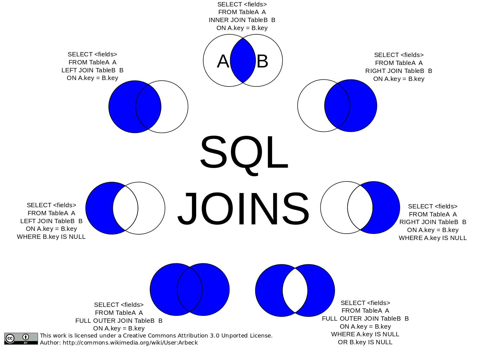

STRUCTURED QUERY LANGUAGE 
========
### Introduction:

SQL is a standard language for accessing and manipulating relational databases.

-----
#### What is SQL?  

- SQL stands for Structured Query Language 
- SQL let you access and manipulate databases
- SQL is an ANSI (American National Standards Institute ) standard
---
#### What can SQL do ?
- execute queries against a database
- retrieve data from a database
- insert records ina database
- update records in database
- delete records in database
- create new database
- create new tables in database
- create stored procedures in a database
- create views in database
- set permissions on tables, procedures and views
-----
#### SQL is Standard -BUT...

Although SQL is an ANSI standard, there are many versions of the SQL language. However, to be compliant with the ANSI standard they all support at least the major commands (SELECT, UPDATE, DELETE, INSERT, WHERE ) in a similar manner. 

---
#### Using SQL in your Website

To build a website that shows some data from a database, need the following

- An RDBMS database program (MS Access, SQL server, MySQL)
- A server-side scripting language(PHP , ASP)
- SQL
- HTML/CSS
----
### RDBMS
RDBMS stands for relational database management system .
RDBMS is the basis for SQL and all modern database systems like MS SQL server, IBM DB2, Oracle, MySQL and Microsoft Access.
The data in RDBMS is stored in database objects called **tables**.
A table is a collection of related data, and it consists of **columns** and **rows**.

#### Database Tables:
A database most often contains one or more tables. Each table is identified by a name (e.g. "Customers" or "orders"). Tables contain records(rows) with data. Example table called "Persons" is below:

|P_Id  | LastName  |FirstName   | Address  | City |
|---|---|---|---|---|
| 1 |Hansen  |Ola |Timoteivn 10|Sandnes |
|2 |Svendson |Tove | Borgvn 23|Sandnes|
|3 |Pettersen|Kari|Storgt 20|Stavanger|

The table above contains three records, one for each person and five columns .

----
#### SQL Statements 
Most of the actions you need to perform on a database are done with SQL Statements.
For example the following SQL Statement will select all the records in the "Persons" table.
````
SELECT * FROM Persons
````
Note: (SQL is not Case Senstive)

#### Semicolon ( ; ) after SQL Statement 
Some databases require a semicolon at the end of each SQL Statement .
Semicolon is a standard way to separate each SQL statement in a database system that allows more than one SQL statement to be executed in the same call to the server.

----
### SQL DML and DDL
SQL can be divided into two parts:
- DML = The Data Manipulation Language 
- DDL = The Data Definition Language 

1. The query and update commands from the **DML** part of SQL:

 - **SELECT** - extract data from databases 
 - **UPDATE** - updates data in a database
 - **DELETE** - deletes data from  a database 
 - **INSERT INTO** - inserts data into database

2. The **DDL** part of SQL permits database tables to be created or deleted. It also defines indexes(keys), specify links between tables and impose constraints between tables. The most important DDL statements in SQL are:
 - **CREATE DATABASE** - crates a new database 
 - **ALTER DATABASE** - modifies a database
 - **CREATE TABLE** -  create a new table
 - **ALTER TABLE** - modifies a table
 - **DROP TABLE** - delete a table
 - **CREATE INDEX** - create an index (search key)
 - **DROP INDEX** - delete an index 


####  SQL SELECT Statement 

The SQL SELECT Statement is used to select data from a database.
The result is stored in a result table, called the result-set.
##### SQL  SELECT Syntax
SELECT column_name(s)
FROM table_name

and 

SELECT * FROM table_name (select all from table_name)

EXAMPLE: the "Persons" table

|P_Id  | LastName  |FirstName   | Address  | City |
|---|---|---|---|---|
| 1 |Hansen  |Ola |Timoteivn 10|Sandnes |
|2 |Svendson |Tove | Borgvn 23|Sandnes|
|3 |Pettersen|Kari|Storgt 20|Stavanger|


##### ⇒  Select statement will be as:
`SELECT LastName, FirstName FROM Persons` </br>
result-set will be as :

| LastName  |FirstName   |
|---|---|
|Hansen  |Ola |
|Svendson |Tove |
|Pettersen|Kari|

##### ⇒  Select * Example:

 `SELECT  *  From Persons`

 Result will be as :

 |P_Id  | LastName  |FirstName   | Address  | City |
|---|---|---|---|---|
| 1 |Hansen  |Ola |Timoteivn 10|Sandnes |
|2 |Svendson |Tove | Borgvn 23|Sandnes|
|3 |Pettersen|Kari|Storgt 20|Stavanger|

----
#### SQL SELECT DISTINCT Example
using the "Persons" table 

SELECT DISTINCT City FROM Persons

Result-set  will be like:


|City|
|---|
| Sandnes  |
|Stavanger|

----
#### SQL WHERE Clause
**SYNTAX** :
```				
	SELECT column_name(s)
	FROM table_name 
	WHERE column_name operator value			
     
 ```
using the "Person" table
```
SELECT * FROM Persons
WHERE City  =  'Sadnes'
```
result-set :

|P_Id  | LastName  |FirstName   | Address  | City |
|---|---|---|---|---|
| 1 |Hansen  |Ola |Timoteivn 10|Sandnes |
|2 |Svendson |Tove | Borgvn 23|Sandnes|

==> Quotes Around TEXT Fields 
SQL use single quotes around text values , most database systems will also accept double quotes .
Although Numeric values should not be enclosed in quotes.

**Operators Allowed in the WHERE Clause**

|Operators | Description |
|---|---|
| = | Equal |
|!=|Not Equal
| <>| Not Equal|
| >|Greater than  |
| <|Less than  |
|>= |Greater than or Equal |
|<=|Less than or Equal|
|BETWEEN|Between an inclusive range|
|LIKE|Search for a pattern|
|IN|If you know the exact value you want to return for at least one of the columns

#### SQL AND & OR Operators 
The AND & OR operators are used to filter records based on more than one conditions.
The AND operator displays a record if both the first condition and the second condition is true.
The OR operator displays a record if either the first or the second condition is true.

using the "Persons" table

AND Example :
````
SELECT * FROM Persons
WHERE FirstName = 'Tove'
AND LastName = 'Svendson'
````
The result-set will be like:

|P_Id  | LastName  |FirstName   | Address  | City |
|---|---|---|---|---|
|2 |Svendson |Tove | Borgvn 23|Sandnes|

OR Example:
````
SELECT * FROM Persons 
WHERE FirstName = 'Tove'
OR FirstName = 'Ola'
````
result-set will look like this:

|P_Id  | LastName  |FirstName   | Address  | City |
|---|---|---|---|---|
| 1 |Hansen  |Ola |Timoteivn 10|Sandnes |
|2 |Svendson |Tove | Borgvn 23|Sandnes|


### The ORDER BY Keyword
The ORDER BY Keyword is used to sort the result-set by a specified column.
The ORDER BY keyword sort the records in ascending order by default. To sort in descending order ,DESC keyword is used.

**Syntax for ORDER BY:**

````
SELECT column_name(s)
From table_name
ORDER BY column_name(s) ASC|DESC
````

"Persons" table.

|P_Id  | LastName  |FirstName   | Address  | City |
|---|---|---|---|---|
| 1 |Hansen  |Ola |Timoteivn 10|Sandnes |
|2 |Svendson |Tove | Borgvn 23|Sandnes|
|3 |Pettersen|Kari|Storgt 20|Stavanger|
|4 |Nilsen |Tom | Vingvn 23|Stavanger|

````
SELECT * 
FROM Persons
ORDER BY LastName
````

|P_Id  | LastName  |FirstName   | Address  | City |
|---|---|---|---|---|
| 1 |Hansen  |Ola |Timoteivn 10|Sandnes |
|4 |Nilsen |Tom | Vingvn 23|Stavanger|
|3 |Pettersen|Kari|Storgt 20|Stavanger|
|2 |Svendson |Tove | Borgvn 23|Sandnes|

**ORDER BY DESC Example**
````
SELECT * 
FROM Persons
ORDER BY LastName DESC
````
|P_Id  | LastName  |FirstName   | Address  | City |
|---|---|---|---|---|
|2 |Svendson |Tove | Borgvn 23|Sandnes|
|3 |Pettersen|Kari|Storgt 20|Stavanger|
|4 |Nilsen |Tom | Vingvn 23|Stavanger|
| 1 |Hansen  |Ola |Timoteivn 10|Sandnes |

----
###The INSERT INTO Statement

The INSERT INTO Statement is used to insert a new row in a table.

It is possible to write the INSERT INTO statement in two forms.

1. This form does not specify the column names where the data will be inserted, only their values:
````
INSERT INTO table_name
VALUES(value1, value2, value3,...)
````
2. The second form specifies both the column names and the values to be inserted:
````
INSERT INTO table_name(column1, column2, column3,...)
VALUES(value1, value2, value3,...)
````
**Example:**
Persons table

|P_Id  | LastName  |FirstName   | Address  | City |
|---|---|---|---|---|
| 1 |Hansen  |Ola |Timoteivn 10|Sandnes |
|2 |Svendson |Tove | Borgvn 23|Sandnes|
|3 |Pettersen|Kari|Storgt 20|Stavanger|
Syntax:
````
INSERT INTO Persons
VALUE (4,'Nilsen','johan','Bakken 2',Stavanger')
````
result-set :

|P_Id  | LastName  |FirstName   | Address  | City |
|---|---|---|---|---|
| 1 |Hansen  |Ola |Timoteivn 10|Sandnes |
|2 |Svendson |Tove | Borgvn 23|Sandnes|
|3 |Pettersen|Kari|Storgt 20|Stavanger|
|4 |Nilsen |Tom | Vingvn 23|Stavanger|


**Insert Data Only in Specified Columns**
````
INSERT INTO Persons (P_Id,LstName,FirstName)
VALUE(5,'Tjessem','Jakob')
````
Result-set:

|P_Id  | LastName  |FirstName   | Address  | City |
|---|---|---|---|---|
| 1 |Hansen  |Ola |Timoteivn 10|Sandnes |
|2 |Svendson |Tove | Borgvn 23|Sandnes|
|3 |Pettersen|Kari|Storgt 20|Stavanger|
|4 |Nilsen |Tom | Vingvn 23|Stavanger|
|5|TJessem|Jakob|   |   |

----
### SQL UPDATE Statement
The UPDATE Statement is used to update records in a table or to update existing records in a table.
**UPDATE Syntax**
````
UPDATE table_name
SET column1 = value, column2 = value,...
WHERE some_column = some_value
````
NOTE: WHERE clause specifies which record should be updated.

Example:
Update the person "Tjessem" in the "persons" table.
````
UPDATE Persons
SET Address = 'Nissestien 67',City = 'Sandnes'
WHERE LastName = 'Tjessem' AND FirstName = 'Jakob'
````


|P_Id  | LastName  |FirstName   | Address  | City |
|---|---|---|---|---|
| 1 |Hansen  |Ola |Timoteivn 10|Sandnes |
|2 |Svendson |Tove | Borgvn 23|Sandnes|
|3 |Pettersen|Kari|Storgt 20|Stavanger|
|4 |Nilsen |Tom | Vingvn 23|Stavanger|
|5|TJessem|Jakob|Nissestien 67 |Sandnes|

Example:
Updating whole columns of Address and City
````
UPDATE Persons
SET Address = 'Nissestien 67',City = 'Sandnes'
````
|P_Id  | LastName  |FirstName   | Address  | City |
|---|---|---|---|---|
| 1 |Hansen  |Ola |Nissestien 67 |Sandnes |
|2 |Svendson |Tove |Nissestien 67 |Sandnes|
|3 |Pettersen|Kari|Nissestien 67 |Sandnes|
|4 |Nilsen |Tom |Nissestien 67 |Sandnes|
|5|TJessem|Jakob|Nissestien 67 |Sandnes|

----
### SQL DELETE Statement 

The DELETE statement is used to delete records(rows) in a table.
**Syntax**
````
DELETE FROM table_name
WHERE some_column = some_value
"where clause specifies which record should be deleted"
````
|P_Id  | LastName  |FirstName   | Address  | City |
|---|---|---|---|---|
| 1 |Hansen  |Ola |Timoteivn 10|Sandnes |
|2 |Svendson |Tove | Borgvn 23|Sandnes|
|3 |Pettersen|Kari|Storgt 20|Stavanger|
|4 |Nilsen |Tom | Vingvn 23|Stavanger|
|5|Tjessem|Jakob|Nissestien 67 |Sandnes|

Example:
Delete the person "Tjessesm,Jakob" in the persons table
````
DELETE FROM Persons 
WHERE LastName = 'Tjessem' AND FirstName = 'Jakob'
````
Result_set:

|P_Id  | LastName  |FirstName   | Address  | City |
|---|---|---|---|---|
| 1 |Hansen  |Ola |Timoteivn 10|Sandnes |
|2 |Svendson |Tove | Borgvn 23|Sandnes|
|3 |Pettersen|Kari|Storgt 20|Stavanger|
|4 |Nilsen |Tom | Vingvn 23|Stavanger|

**DELETE ALL ROWS**
````
DELETE FROM table_name
or
DELETE * FROM table_name
````
----
### The TOP Clause
The TOP Clause is used to specify the number of records to return.
The Top clause can be very useful on large tables with thouseds of records. Returning a large number of records can impact on performance.
Not all database system support the TOP clause.

**SQL Server Syntax**
````
SELECT TOP number|percent column_name(s)
FROM table_name
````
-------
### SQL SELECT TOP Equivalent in My SQL and Oracle
#### MySQL Syntax
````
SELECT column_name(S)
FROM table_name
LIMIT number

**Example**
SELECT *
FROM Persons
LIMIT 5
````
**Oracle Syntax**
````
SELECT column_name(s)
FROM table_name
WHERE ROWNUM <= number 

**Example**

SELECT *
FROM Person WHERE ROWNUM <= 5
````
--------
#### SQL TOP Example
|P_Id  | LastName  |FirstName   | Address  | City |
|---|---|---|---|---|
| 1 |Hansen  |Ola |Timoteivn 10|Sandnes |
|2 |Svendson |Tove | Borgvn 23|Sandnes|
|3 |Pettersen|Kari|Storgt 20|Stavanger|
|4 |Nilsen |Tom | Vingvn 23|Stavanger|
````
SELECT TOP 2 * FROM Persons
````
RESULT-SET:

|P_Id  | LastName  |FirstName   | Address  | City |
|---|---|---|---|---|
| 1 |Hansen  |Ola |Timoteivn 10|Sandnes |
|2 |Svendson |Tove | Borgvn 23|Sandnes|

-----
#### SQL TOP PERCENT Example
|P_Id  | LastName  |FirstName   | Address  | City |
|---|---|---|---|---|
| 1 |Hansen  |Ola |Timoteivn 10|Sandnes |
|2 |Svendson |Tove | Borgvn 23|Sandnes|
|3 |Pettersen|Kari|Storgt 20|Stavanger|
|4 |Nilsen |Tom | Vingvn 23|Stavanger|
````
SELECT TOP 50 PERCENT * FROM Persons
````
Result-set:

|P_Id  | LastName  |FirstName   | Address  | City |
|---|---|---|---|---|
| 1 |Hansen  |Ola |Timoteivn 10|Sandnes |
|2 |Svendson |Tove | Borgvn 23|Sandnes|
-------
### SQL LIKE Operator
The LIKE operator is used in a WHERE clause to search for a specified pattern in a column.
````
SELECT column_name(s)
FROM table_name
WHERE column_name LIKE pattern
````
Example:
persons table:

|P_Id  | LastName  |FirstName   | Address  | City |
|---|---|---|---|---|
| 1 |Hansen  |Ola |Timoteivn 10|Sandnes |
|2 |Svendson |Tove | Borgvn 23|Sandnes|
|3 |Pettersen|Kari|Storgt 20|Stavanger|
|4 |Nilsen |Tom | Vingvn 23|Stavanger|
````
SELECT * FROM persons
WHERE City LIKE 's%'

(The % sign can be used to define wildcards /missing letters in the pattern) both before and after the pattern.
````
Result-set:

|P_Id  | LastName  |FirstName   | Address  | City |
|---|---|---|---|---|
| 1 |Hansen  |Ola |Timoteivn 10|Sandnes |
|2 |Svendson |Tove | Borgvn 23|Sandnes|
|3 |Pettersen|Kari|Storgt 20|Stavanger|
|4 |Nilsen |Tom | Vingvn 23|Stavanger|

````
SELECT * FROM Persons
WHERE City LIKE '%S'
````
|P_Id  | LastName  |FirstName   | Address  | City |
|---|---|---|---|---|
| 1 |Hansen  |Ola |Timoteivn 10|Sandnes |
|2 |Svendson |Tove | Borgvn 23|Sandnes|
````
SELECT * FROM Persons
WHERE City like '%tav%'
````
Result-set:

|P_Id  | LastName  |FirstName   | Address  | City |
|---|---|---|---|---|
|3 |Pettersen|Kari|Storgt 20|Stavanger|
|4 |Nilsen |Tom | Vingvn 23|Stavanger|
````
SELECT *FROM Persons
WHERE City NOT LIKE '%tav%'
````
Result-set:

|P_Id  | LastName  |FirstName   | Address  | City |
|---|---|---|---|---|
| 1 |Hansen  |Ola |Timoteivn 10|Sandnes |
|2 |Svendson |Tove | Borgvn 23|Sandnes|

-----
### SQL Wildcards
SQL wildcards can be used when searching for data in a database.
SQL wildcards must be used with the SQL LIKE operator.
SQL wildcards can be substituted for one or more character when searching for a data in a database.

|Wildcard|Description|
|---|---|
|%|A substitute for a zero or more characters|
|-|a substitute for exactly one character |
|[charlist]|Any single character in charlist|
|[^charlist]|Any single character not in charlist|
|[!charlist]|Any single character not in charlist|

Persons table:

|P_Id  | LastName  |FirstName   | Address  | City |
|---|---|---|---|---|
| 1 |Hansen  |Ola |Timoteivn 10|Sandnes |
|2 |Svendson |Tove | Borgvn 23|Sandnes|
|3 |Pettersen|Kari|Storgt 20|Stavanger|
|4 |Nilsen |Tom | Vingvn 23|Stavanger|

Example syntax:
````
SELECT * FROM persons
WHERE LastName LIKE 'S_end_on'
````
|P_Id  | LastName  |FirstName   | Address  | City |
|---|---|---|---|---|
|2 |Svendson |Tove | Borgvn 23|Sandnes|
````
SELECT *FROM Persons
WHERE LastName LIKE '[bsp]%'
````
|P_Id  | LastName  |FirstName   | Address  | City |
|---|---|---|---|---|
|2 |Svendson |Tove | Borgvn 23|Sandnes|

````
SELECT *FROM Persons
WHERE LastName LIKE '[!bsp]%'
````
|P_Id  | LastName  |FirstName   | Address  | City |
|---|---|---|---|---|
| 1 |Hansen  |Ola |Timoteivn 10|Sandnes |

-----
### SQL IN Operator 
The IN operator allows you to specify multiple values in a WHERE clause.
````
SELECT colum_name(s)
FROM table_name
WHERE column_name IN (value1, value2,...)
````
Persons table:

|P_Id  | LastName  |FirstName   | Address  | City |
|---|---|---|---|---|
| 1 |Hansen  |Ola |Timoteivn 10|Sandnes |
|2 |Svendson |Tove | Borgvn 23|Sandnes|
|3 |Pettersen|Kari|Storgt 20|Stavanger|
|4 |Nilsen |Tom | Vingvn 23|Stavanger|
````
SELECT *
FROM Persons
WHERE LastName IN ('Hansen','Pettersen')
````
result-set:

|P_Id  | LastName  |FirstName   | Address  | City |
|---|---|---|---|---|
| 1 |Hansen  |Ola |Timoteivn 10|Sandnes |
|3 |Pettersen|Kari|Storgt 20|Stavanger|

-------
### SQL BETWEEN Operator
The BETWEEN Operator is used in a WHERE clause to select a range of data between two values.
The values can be numbers, text or dates.
````
SELECT colum_name(s)
FROM table_name
WHERE column_name 
BETWEEN value1 AND value2
````
Persons table:

|P_Id  | LastName  |FirstName   | Address  | City |
|---|---|---|---|---|
| 1 |Hansen  |Ola |Timoteivn 10|Sandnes |
|2 |Svendson |Tove | Borgvn 23|Sandnes|
|3 |Pettersen|Kari|Storgt 20|Stavanger|
|4 |Nilsen |Tom | Vingvn 23|Stavanger|
````
SELECT *
FROM Person
WHERE LastName 
BETWEEN 'Hansen' AND 'Pettersen'
````
Result set:

|P_Id  | LastName  |FirstName   | Address  | City |
|---|---|---|---|---|
| 1 |Hansen  |Ola |Timoteivn 10|Sandnes |

NOTE:-
The BETWEEN operator is treated differently in different databases.
In some databases' person with the last_name of "Hansen" or "Pettersen" will not be listed because the BETWEEN operator only selects fields that are between and excluding the test values.
In other databases' person with the LastName of "Hansen" or "Pettersen" will be listed because the BETWEEN operator selects fields that are between and including the test values.
In some databases' person with the LastName of "Hansen" will be listed but "Pettersen" will not be listed like example above because the BETWEEN operator selects fields between the test values, including the first value and excluding the last test value.
Therefore, it is better to check how a database treats the BETWEEN operator.

Example:
````
SELECT * FROM Persons
WHERE LastName 
NOT BETWEEN 'Hansen' AND 'Pettersen'
````
result-set:

|P_Id  | LastName  |FirstName   | Address  | City |
|---|---|---|---|---|
|2 |Svendson |Tove | Borgvn 23|Sandnes|
|3 |Pettersen|Kari|Storgt 20|Stavanger|

-------
### SQL Alias
With SQL an alias name can be given to a table or a column. This can be a good thing to do if you have a very long or complex table name or column names. An alias name could be anything, but usually it is short.
````
Aias syntax for tables

SELECT column_name(s)
FROM table_name
AS alias_name

Alias syntax for cloumns

SELECT column_name AS alias_name
FROM table_name
````
Example:
If we have a table called persons table and other table called product_orders.We will give tha table aliases of "p" and "po" respectively.

````
SELECT clause without aliass

SELECT Product_orders.Order_id, person.FirstName, persons.LastName
FROM Persons,
Product_orders
WHERE Person.LastName='Hansen' AND Persons.First_name='Ola'

SELECT clause with aliases

SELECT po.Order_id,p.First_name,p.LastName
FROM Persons AS p,
Product_order AS po
WHERE p.LastName='Hansen' AND p.FirstName= 'Ola'
````

-------
### SQL Joins
SQL joins are used to query data from two or more tables, based on a relationship between certain columns in tables.
##### SQL JOIN
The JOIN keyword is used in an SQL statement to query data from two or more tables, based on a relationship between certain column in these tables.
Tables in a database are often related to each other with keys.
A primary key is a column (or a combinations of columns) with a unique value for each row. Each primary key value must be unique within the table. The purpose is to bind data together across tables without repeating all the data in every table.




the persons table:

|P_id  | LastName  |FirstName   | Address  | City |
|---|---|---|---|---|
| 1 |Hansen  |Ola |Timoteivn 10|Sandnes |
|2 |Svendson |Tove | Borgvn 23|Sandnes|
|3 |Pettersen|Kari|Storgt 20|Stavanger|


the orders table:

|O_id|OrderNo|P_id|
|---|---|---|
|1|77895|3|
|2|44678|3|
|3|22456|1|
|4|24562|1|
|5|34764|15|

The P_id columnn is the primary key in the "persons" table. This means that **no** two rows can have the same P_id. The P_id distinguishes two persons even if they have the same name.

The O_id column is the priamry key in the orders table and that the p_id column refers to the persons in the persons table without using their names.
The relationship between the column is the "p_id".

#### Different SQL JOINs
- JOIN: Retuen rows when there is atleast one match in both tables.
- LEFT JOIN: Return all rows from the left table , even if there are no matches in the right table.
- RIGHT JOIN: Return all rows from thr right table, even if there are no matches in the left table.
- FULL JOIN: Return rows when there is a match in one oft the tables.
------
#### INNER JOIN/JOIN:
The INNER JOIN keyword return rows when there is at least one match in the both tables.
Syntax:
````
SELECT column_name(s)
FROM table_name1
INNER JOIN table_name2
ON table_name1.column_name = table_name2.column_name
````

Example:
Persons table:


|P_id  | LastName  |FirstName   | Address  | City |
|---|---|---|---|---|
| 1 |Hansen  |Ola |Timoteivn 10|Sandnes |
|2 |Svendson |Tove | Borgvn 23|Sandnes|
|3 |Pettersen|Kari|Storgt 20|Stavanger|


the orders table:

|O_id|OrderNo|P_id|
|---|---|---|
|1|77895|3|
|2|44678|3|
|3|22456|1|
|4|24562|1|
|5|34764|15|
````
SELECT Persons.LastName,Persons.FirstName,Orders.OrderNo
FROM Persons 
INNER JOIN orders 
ON Persons.P_id = Orders.P_id
ORDERBY Persons.LastName
````
Result-Set:

|LastName|FirstNmae|OrderNo|
|---|---|---|
|Hansen|Ola|22456|
|Hansen|Ola|24562|
|Pettersen|Kari|77895|
|Pettersen|Kari|44678|

The INNER JOIN /JOIN keyword return rows when there is at least one much in both tables.
If there are rows in "Persons" that do not have matches in "Orders", those rows will NOT be listed.
-----

#### SQL LEFT JOIN/LEFT OUTER JOIN 
The LEFT JOIN keyword returns all rows from the left table(table_name1), even if there are no matches in the right table(table_name2).

Syntax:
````
SELECT column_name(s)
FROM table_name1
LEFT JOIN table_name2
ON table_name1.column_name = table_name2.column_name
````
EXAMPLE:
List the persons and their orders if any ,from the tables of person and orders.
````
SELECT Persons.LastName,Persons.FirstName,Orders.OrderNo
FROM PERSONS
LEFT JOIN Orders
ON Persons.P_id = Orders.P_id
ORDER BY Persons.LastName
````

Result-Set:

|LastName|FirstName|OrderNo|
|---|---|---|
|Hansen|Ola|22456|
|Hansen|Ola|24562|
|Pettersen|Kari|77895|
|Pettersen|Kari|44678|
|Svendson|Tove||

-------------------------------------------
### RIGHT JOIN Keyword
The RIGHT JOIN keyword return all rows from the right table(table_name2),even if there are no matches in the left table(table_name1).

Syntax:
````
SELECT column_name(s)
FROM table_name1
RIGHT JOIN table_name2
ON table_name1.column_name = table_name2.column_name
````
result-set:

|O_id|OrderNo|P_id|
|---|---|---|
|1|77895|3|
|2|44678|3|
|3|22456|1|
|4|24562|1|
|5|34764|15|

Example2:
list all the orders with containing persons -if any ,from the persons and orders table.
````
SELECT Persons.LastNmae,Persons.FirstName,Orders.OrderNo
FROM Persons
RIGHT JOIN Orders
ON Persons.P_id = Orders.OrderNo
ORDER BY Persons.LastNmae
````
Result-Set:

|LastName|FirstName|OrderNo|
|---|---|---|
|Hansen|Ola|22456|
|Hansen|Ola|24562|
|Pettersen|Kari|77895|
|Pettersen|Kari|44678|
|||34764|

Right JOin keyword return all the rows from the right table(Orders),even if there are no matches in the left table(Persons).

--------------------------------------
#### SQL FULL JOIN Keyword
The FULL JOIN keyword return rows when there is a match in one of the tables.
Syntax:
````
SELECT column_name(s)
FROM table_name1
FULL JOIN table_name2
ON table_name1.column_name = table_name2.column_name
````
Example:

Persons table:


|P_id  | LastName  |FirstName   | Address  | City |
|---|---|---|---|---|
| 1 |Hansen  |Ola |Timoteivn 10|Sandnes |
|2 |Svendson |Tove | Borgvn 23|Sandnes|
|3 |Pettersen|Kari|Storgt 20|Stavanger|

Orders table

|O_id|OrderNo|P_id|
|---|---|---|
|1|77895|3|
|2|44678|3|
|3|22456|1|
|4|24562|1|
|5|34764|15|

Get all the persons and their orders, and all the orders with their persons.
````
SELECT Persons.LastName,Person.FirstName,Orders.OrderNo
FROM Persons
FULL JOIN Orders
ON Persons.P_id = Orders.P_id
ORDER BY Persons.LastName
````
Result set:


|LastName|FirstName|OrderNo|
|---|---|---|
|Hansen|Ola|22456|
|Hansen|Ola|24562|
|Pettersen|Kari|77895|
|Pettersen|Kari|44678|
|Svendson|Tove||
|||34764|

The FULL JOIN keyword returns all the rows from the left table(Persons) and all the rows fromthe right table(Orders). If there are rows in "Persons" that do not have matches in "Orders", or if there are rows in "Orders" that do not have matches in "Persons", those rows will be listed as well.

--------------------------------------
### SQL UNION Operator
The SQL UNION operator combines two or more SELECT statement.
The UNION operator is used to combine the result-set of two or more SELECT statement.
But each SELECT statement within the UNION must have the same number of columns.
The column must also have similar data types. Also, the columns in each SELECT statement must be in the same order.
````
SELECT column_name(s) FROM table_name1
UNION
SELECT column_name(s) FROM table_name2
````
The UNION operator selects only distint values by default. To alow duplicate values,
use UNION ALL.
#### SQL UNION ALL 
````
SELECT column_name(s) FROM table_name1
UNION ALL
SELECT column_name(s) FROM table_name2
````
The column names in the result-set of a UNION are always equal to the column names in the first SELECT statement in the UNION.
EXAMPLES :
Table : employees_norway

|e_id|e-name|
|---|---|
|1|hansen,ola|
|2|svendson,tove|
|3|svendson,stephen|
|4|pettersen,kari|

table : employees_USA

|e_id|e_name|
|---|---|
|1|turner,sally|
|2|kent,clark|
|3|svendson,stephen|
|4|scott,stephen|

Example: List all the different employees in Norway and USA.
````
SELECT e_name FROM employees_Norway
UNION
SELECT e_name FROM employees_USA
````
Result-set:

|e-name|
|---|
|hansen,ola|
|svendson,tove|
|svendson,stephen|
|pettersen,kari|
|turner,sally|
|kent,clark|
|scott,stephen|

This command can not be used to list all employees in Norway and USA. In the example above we have two employees with equal names and only one of them will be listed. The UNION command select only distinct values.

Example : List all employees in Norway and USA.
````
SELECT e_name FROM employees_USA
UNION ALL
SELECT e_name FROM employees_USA
````
result-set:

|e-name|
|---|
|hansen,ola|
|svendson,tove|
|svendson,stephen|
|pettersen,kari|
|turner,sally|
|kent,clark|
|svendson,stephen|
|scott,stephen|

----------------------------------------
### SQL SELECT INTO Statement 
- The SELECT INTO statement can be used to create backup copies of tables.
- The SELECT INTO statement selects data from one table and inserts it into a different table.
- The SELECT INTO statement is most often used to create backup copies of tables.
````
SELECT *
INTO new_table_name[IN externaldatabase]
FROM old_tablename

or we can select only the columns we want into the new table.

SELECT column_name(s)
INTO new_table_name[IN externaldatabase]
FROM old_tablename
````
Example:
Make a backup copy - make an exact copy of data in "Persons" table.
````
SELECT *
INTO persons_backup
FROM persons

by using IN clause to copy the table into another database:

SELECT *
INTO persons_backup IN 'backup.mdb'
FROM persons

Can copy only a few fields into the new table:

SELECT LastName,FirstName 
INTO persons_backup
FROM persons
````
-------------------------------------------
#### SQL SELECT INTO with a WHERE clause
This SQL statement creates a persons_backup table wih only the person who lives in the city "sandnes"
````
Select LastNmae ,FirstName 
INTO persons_backup
FROM persons
WHERE City= 'Sandnes'
````
--------------------------------------------

#### SQL SELECT INTO - Joined Tables
Selecting data from more than one table is also possible.
Example : create a "persons_order_backup" table from the two tables "persons "
and "orders".
````
SELECT Persons.Last Name,Orders.OrderNo
INTO persons_order_backup
FROM Persons
INNER JOIN Orders
ON Persons.P_id = Orders.P_id
````
------------------
### SQL CREATE DATABASE Statement
CREATE DATABASE Statement is used to create a database 
Syntax:
````
CREATE DATABASE database_name
````
Example:
Create a database called "my_db"
````
CREATE DATABASE my_db
````
-------------------------------------
#### CREATE TABLE Statement
The CREATE TABLE statement is used to create a table in a database.
Syntax:
````
CREATE TABLE table_name
(
column_name1 dat_type,
column_name2 dat_type,
column_name3 dat_type,
column_name4 dat_type,
....
)
````
The data type specifies what type of data the column can hold.

Example:
Create a table called persons that contains five columns:
p_id ,last_name, first_name, address, city
````
CREATE TABLE persons
(
p_id int,
last_name varchar(225),
first_name varchar(225)
address varchar(225)
city varchar(225)
)
````
NOTE : p_id is int/integer type and rest of the columns are variable character with a max length of 225 characters.

Result-set = persons table 

|p_id|last_name|first_name|address|city|
|---|---|---|---|---|
||||||

-----------------------------
### SQL Constraints
Constraints are used to limit the type f data that can go into a table.

Constraints can be specified when a table is created(with CREATE TABLE) or after the table is created(with ALTER TABLE).

CONSTRAINTS:
- NOT NULL
- UNIQUE
- PRIMARY KEY
- FOREIGN KEY
- CHECK
- DEFAULT 

---------------------

### SQL NOT NULL Constraint:

----------------------------
The NOT NULL constraint enforces a column to NOT accept NULL value.

The NOT NULL constraint enforces a field to always contain a value. This means you can insert a new record or update a record without adding a value to this field.

Example:
This example enforces the p_id column and the last_name column to not accept NULL value:
````
CREATE TABLE persons
(
p_id int NOT NULL,
last_name varchar(225) NOT NULL,
first_name varchar(225)
address varchar(225)
city varchar(225)
)
````

---------------------

### SQL UNIQUE Constraint

----------------------------
The **UNIQUE** constraint uniquely identifies each record in a database table.

The **UNIQUE** and **PRIMARY KEY** constraints both provide a guarantee for uniqueness for a column or set of columns.

A **PRIMARY KEY** constraints automatically has a **UNIQUE** constraint defined on it.

You can have many unique constraints per table but **only one PRIMARY KEY** constraint per table.


EXAMPLE:
**SQL UNIQUE Constraint on CREATE TABLE**

**MySQL:**
````
CREATE TABLE persons
(
p_id int NOT NULL,
last_name varchar(225) NOT NULL,
first_name varchar(225)
address varchar(225)
city varchar(225)
UNIQUE(p_id)
)
````

**SQL Server/Oracle/MS Access:**
````
CREATE TABLE persons
(
p_id int NOT NULL UNIQUE,
last_name varchar(225) NOT NULL,
first_name varchar(225)
address varchar(225)
city varchar(225)
)
````

**MySQL / SQL Server / Oracle / MS Access:**
To allow naming if a UNIQUE constraint and for defining a UNIQUE constraint on multiple columns.
````
CREATE TABLE persons
(
p_id int NOT NULL,
last_name varchar(225) NOT NULL,
first_name varchar(225)
address varchar(225)
city varchar(225)
CONSTRAINT uc_personID UNIQUE(p_id,last_name)
)
````

---------------------
#### SQL UNIQUE Constraint on ALTER TABLE
To create a UNIQUE constraint on the "p_id" column when the table is already created.

**MySQL / SQL Server / Oracle / MS Access:**
````
ALTER TABLE persons
ADD UNIQUE(p_id)
````
**MySQL / SQL Server / Oracle / MS Access:**
To allow naming if a UNIQUE constraint and for defining a UNIQUE constraint on multiple columns.

````
ALTER TABLE persons
ADD CONSTRAINT uc_personID UNIQUE (p_id,last_name)
````

-----------------------
### To DROP a UNIQUE Constraint
**My SQL**
````
ALTER TABLE persons
DROP INDEX uc_personID
````

**SQL Server / Oracle / MS Access:**
````
ALTER TABLE persons
DROP CONSTRAINT uc_personID

````
------------------
### SQL PRIMARY KEY Constraint

--------------------------------
The PRIMARY KEY constraint uniquely identifies  each record in a database table.

Primary keys must contain unique values.

A primary key column can not contain NULL values.

Each table should have a primary key and each table can have only ONE primary key .

-----------
### SQL PRIMARY KEY Constraint on CREATE TABLE
The following SQL creates a  PRIMARY KEY on the "p_id" column when the "persons" table is created.

**My SQL**

````
CREATE TABLE persons
(
p_id int NOT NULL,
last_name varchar(225) NOT NULL,
first_name varchar(225)
address varchar(225)
city varchar(225)
PRIMARY KEY (p_id)
)
````

**SQL Server / Oracle / MS Access:**

````
CREATE TABLE persons
(
p_id int NOT NULL PRIMARY KEY,
last_name varchar(225) NOT NULL,
first_name varchar(225)
address varchar(225)
city varchar(225)
)
````
**MySQL / SQL Server / Oracle / MS Access:**
To allow naming if a PRIMARY KEY constraint and for defining a PRIMARY KEY constraint on multiple columns.

````
CREATE TABLE persons
(
p_id int NOT NULL,
last_name varchar(225) NOT NULL,
first_name varchar(225)
address varchar(225)
city varchar(225)
CONSTRAINT pk_personID PRIMARY KEY (p_id,last_name)
)
````

#### SQL PRIMARY KEY Constraint on ALTER TABLE

To create a PRIMARY KEY constraint on the "p_id" column when the table is already created.
**MySQL / SQL Server / Oracle / MS Access:**
````
ALTER TABLE persons
ADD PRIMARY KEY (p_id)
````
**MySQL / SQL Server / Oracle / MS Access:**
To create a PRIMARY KEY constraint and for defining a PRIMARY KEY constraint on multiple columns.

````
ALTER TABLE persons
ADD CONSTRAINT pk_personID PRIMARY KEY (p_id,last_name)
````
NOTE: If you use the ALTER TABLE statement to add a primary key, the primary key columns must already have been declared to not contain NULL values ,when the table was first created.

---------------------
#### To DROP a PRIMARY KEY Constraint 
To drop a PRIMARY KEY constraint :
````
ALTER TABLE persons
DROP PRIMARY KEY
````

**SQL Server / Oracle / MS Access:**
````
ALTER TABLE persons
DROP CONSTARINT pk_personID
````

------------------
### SQL FOREIGN KEY Constraint

---------------------------------
A FOREIGN KEY in one table points to a PRIMARY KEY in another table.

Example:

**Persons table**

|P_id  | LastName  |FirstName   | Address  | City |
|---|---|---|---|---|
| 1 |Hansen  |Ola |Timoteivn 10|Sandnes |
|2 |Svendson |Tove | Borgvn 23|Sandnes|
|3 |Pettersen|Kari|Storgt 20|Stavanger|

**Orders table**

|O_id|OrderNo|P_id|
|---|---|---|
|1|77895|3|
|2|44678|3|
|3|22456|2|
|4|24562|1|

- The "P_id" column in the "orders" table points to the "P_id" column in the "Persons" table.
- The "P_id" column in the "Persons" table is the PRIMARY KEY in the "Persons" table.
- The "P_id" column in the "Orders" table is a FOREIGN KEY in the "ORDERS" table.
- The FOREIGN KEY constraint is used to prevent actions that would destroy links between table.
- The FOREIGN KEY constraint also prevents that invalid data from being inserted into the foreign key column, because it has to be one of the values contained in the table it points to.

#### SQL FOREIGN KEY Constraint on CREATE TABLE
Example : Create a FOREIGN KEY on the "P_id" column when the "Orders" table is created.

**MySQL**
````
CREATE TABLE orders
(
O_id int NOT NULL,
OderNo int NOT NULL,
P_id int,
PRIMARY KEY (O_id),
FORIEIGN KEY (P_id) REFRENCES Persons(P_id)
)
````
**SQL Server / Oracle / MS Access:**
````
CREATE TABLE orders
(
O_id int NOT NULL PRIMARY KEY,
OderNo int NOT NULL,
P_id int FORIEIGN KEY (P_id) REFRENCES Persons(P_id),

)
````
**MySQL / SQL Server / Oracle / MS Access:**
To allow naming of a FOREIGN KEY constraint and for defining a FOREIGN KEY constraint on multiple columns.
````
CREATE TABLE orders
(
O_id int NOT NULL,
OderNo int NOT NULL,
P_id int,
PRIMARY KEY (O_id),
CONTRAINT fk_PerOrders FORIEIGN KEY (P_id),
REFRENCES Persons(P_id)
)
````
-------------
#### SQL FOREIGN KEY Constraint on ALTER TABLE
Example : Create a FOREIGN KEY constraint on the "P_id" column when the "Orders" table is already created.

**MySQL / SQL Server / Oracle / MS Access:**
````
ALTER TABLE Orders
ADD FOREIGN KEY(P_id)
REFERENCES Persons(P_id)
````

**MySQL / SQL Server / Oracle / MS Access:**
To allow naming of a FOREIGN KEY constraint and for defining a FOREIGN KEY constraint on multiple columns.

````
ALTER TABLE Orders
ADD CONSRAINT fk_PerOrder,
FOREIGN KEY(P_id),
REFERENCES Persons(P_id)
````
---------------

#### To DROP a FOREIGN KEY Constraint
To drop a FOREIGN KEY constraint :
**MYSQL**
````
ALTER TABLE Orders
DROP  FOREIGN KEY fk_PerOrder
````

**SQL Server / Oracle / MS Access:**
````
ALTER TABLE persons
DROP CONSTARINT fk_PerOrder
````
-----------------

### SQL CHECK Constraint

-----------------------
The CHECK constraint is used to limit the value range that can be placed in a column.

If you define a CHECK constraint on a single column it allows only certain values for this column.

If you define a CHECK constraint on a table it can limit the value in certain columns based on values in other columns in the row.

----------------
#### SQL CHECK Constraint on CREATE TABLE
The following SQL creates a CHECK constraint on the "P_id" column when the "persons" table is created. The CHECK constraint specifies that the column "P_id" must only include integers greater than 0.

**MySQL**
CREATE TABLE Persons
(
P_id into NOT NULL,
last_name varchar(225) NOT NULL,
first_name varchar(225),
address varchar(225),
city varchar(225),
CHECK (P_id>0)
)

**SQL Server / Oracle / MS Access:**
CREATE TABLE Persons
(
P_id int NOT NULL CHECK(P_id>0),
last_name varchar(225) NOT NULL,
first_name varchar(225),
address varchar(225),
city varchar(225) 
)

To allow naming of a CHECK constraint and for defining a CHECK constraint on multiple columns.

**MySQL / SQL Server / Oracle / MS Access:**
To allow naming of a CHECK constraint and for defining a CHECK constraint on multiple columns.

CREATE TABLE Persons
(
P_id int NOT NULL,
last_name varchar(225) NOT NULL,
first_name varchar(225),
address varchar(225),
city varchar(225)
CONSTRAINT chk_person CHECK(P_id>0 AND city = 'Sandnes')
)

-----------------
#### SQL CHECK Constraint on ALTER TABLE
To create a CHECK constraint on the "P_id" column when the table is already created.

**MySQL / SQL Server / Oracle / MS Access:**
````
ALTER TABLE Persons
ADD CHECK (P_id>0)
````
--------------------
**MySQL / SQL Server / Oracle / MS Access:**
````
ALTER TABLE Persons
ADD CONSTRAINT chk_Person CHECK (P_id>0 AND city = 'Sandnes')

````
----------------
#### To DROP a CHECK Constraint

To drop a CHECK constraint
**SQL Server / Oracle / MS Access:**
````
ALTER TABLE Persons
DROP CONSTRAINT chk_person
````
-----------------------
### SQL DEFAULT Constraint 

The DEFAULT constraint is used to insert a default value into a column.
The default value will be added to all new records, if no other value is specified.

-------------------
#### SQL DEFAULT Constraint on CREATE TABLE
The following SQL creates a DEFAULT constraint on the "city" column when the "persons" table is created.

**MySQL / SQL Server / Oracle / MS Access:**
````
CREAT TABLE persons
(
P_id int NOT NULL,
last_name varchar(225) NOT NULL,
first_name varchar(225),
address varchar(225),
city varchar(225) DEFAULT 'Sandnes'
)
````
The DEFAULT constraint can also be used to insert system values by using functions like GETDATE() :
````
CREATE TABLE Orders
(O_id int NOT NULL,
OrderNo int NOT NULL,
P_id int,
OrderDate date DEFAULT GETDATE()
)
````
------------------------------
#### SQL DEFAULT Constraint on ALTER TABLE
To create a DEFAULT constraint on the "city" column when the table is already created.
**MySQL:**
````
ALTER TABLE persons
ALTER city SET DEFAULT 'SANDNES'
````
---------------
#### To DROP a DEFAULT Constraint
To drop a DEFAULT constraint 
**MySQL:**
````
ALTER TABLE persona 
ALTER city DROP DEFAULT 
````
**SQL Server / Oracle / MS Access:**
````
ALTER TABLE persons 
ALTER COLUMN city DROP DEFAULT
````
------------------------

### SQL CREATE INDEX Statement 
The CREATE INDEX statement is used to create indexes in table.

Indexes allow the database application to find data fast, without reading the table.

#### Indexes
An index can be created in a table to find data more quickly and efficiently.

The user cannot see the indexes, they are just used to speed up searches/queries.
Updating a table with indexes takes more time than updating a table without because the indexes also need an update. So we should only create indexes on columns and table that will be frequently searched against.

**SQL CREATE INDEX Syntax**
Create an index on a table. Duplicate values are allowed:
````
CREATE INDEX index_name
ON table_name(column_name)
````
**SQL CREATE UNIQUE INDEX Syntax**
Create a unique index on a table. Duplicate values are allowed:

````
CREATE UNIQUE INDEX index_name
ON table_name(column_name)
````
The syntax for creating indexes varies amongst different databases.

Example:
Create an index named "pIndex" on the "last_name" column in the "persons" table:
````
CREATE INDEX pIndex
ON persons(last_name,first_name)
````

-----------------
#### SQL DROP INDEX, DROP TABLE & DROP DATABASE
Indexes, tables and databases can easily be deleted/removed with the DROP statement.

**The DROP INDEX Statement**
The DROP INDEX statement is used to delete an index in a table.
**MS Access**
````
DROP INDEX index_name ON table_name
````
**MS SQL Server**
````
DROP INDEX table_name.index_name
````
**DB2/Oracle**
````
DROP INDEX index_name
````
**MySQL**
````
ALTER TABLE table_name DROP index_name
````
-------------------
### The DROP TABLE Statement
The DROP TABLE statement is used to delete a table.
````
DROP TABLE table_name
````
-----------
### The DROP DATABASE Statement
The DROP DATABASE statement is used to delete a database.
````
DROP DATABASE database_name
````
-----------
### The TRUNCATE TABLE Statement
To delete the data inside the table and not the table itself.
````
TRUNCATE TABLE table_name
````
### SQL ALTER TABLE Statement
The ALTER TABLE statement is used to add, delete or modify columns in an existing table.
**To add a column in a table**
````
ALTER TABLE table_name
ADD column_name datatype
````
**To delete a column in a table**
````
ALTER TABLE table_name
DROP COLUMN column_name
````
**To change the data type of column in a table**
````
ALTER TABLE table_name
DROP COLUMN column_name datatype
````
Example:
Add a column named "date_of_birth" in the "persons" table.

Persons table:

|P_id  | LastName  |FirstName   | Address  | City |
|---|---|---|---|---|
| 1 |Hansen  |Ola |Timoteivn 10|Sandnes |
|2 |Svendson |Tove | Borgvn 23|Sandnes|
|3 |Pettersen|Kari|Storgt 20|Stavanger|

````
ALTER TABLE persons
ADD date_of_birth date
````
Date_of_birth column is of type data  and is going to hold date.
The data type specifies what type of data the column can hold.

Result_set:

|P_id  | LastName  |FirstName   | Address  | City |date_of_birth|
|---|---|---|---|---|---|
| 1 |Hansen  |Ola |Timoteivn 10|Sandnes ||
|2 |Svendson |Tove | Borgvn 23|Sandnes||
|3 |Pettersen|Kari|Storgt 20|Stavanger||

-------------
#### Change Data Type Example
To change the data type of column name "date_of_birth"
````
ALTER TABLE persons
ALTER COLUMN date_of_birth year
````
The date_of_birth column is now of type year and is going to hold a year in a two_digit or four_digit format.

--------------------
#### DROP COLUMN Example

Delete the column named "date_of_birth" in the "persons" table.
````
ALTER TABLE persons
DROP COLUMN date_of_birth
````
Result-set:

|P_id  | LastName  |FirstName   | Address  | City |
|---|---|---|---|---|
| 1 |Hansen  |Ola |Timoteivn 10|Sandnes |
|2 |Svendson |Tove | Borgvn 23|Sandnes|
|3 |Pettersen|Kari|Storgt 20|Stavanger|

-----------------------------------------------
### AUTO INCREMENT a Field
Auto_increment allows a unique number to be generated when a new record is inserted into a table.

Very often we would like the value of the primary key field to be created automatically every time a record is inserted.
We would like to create an auto_increment field in a table.

**Syntax:**
**MySQL**
````
CREATE TABLE persons
(
p_id int NOT NULL AUTO_INCREMENT,
last_name varchar(225) NOT NULL,
first_name varchar(225),
address varchar(225),
city varchar(225),
PRIMARY KEY(p_id)
)
````
MySQL uses the AUTI_INCREMENT keyword to perform an auto_increment feature.

By default, the starting value for AUTO_INCREMENT is 1, and it will increment by 1 for each new record.

**→To let the AUTO_INCREMENT sequence start with another value :**
````
ALTER TABLE persons AUTO_INCREMENT = 100
````

**→To insert a new record into the "persons" table, we will have to specify the value for the "p_id" column, a unique value will be added automatically:**
````
INSERT INTO persons(first_name,last_name)
VALUES('Lars','Monsen')
````

The SQL statement above would insert a new record into the "persons" table. The "p_id" column would be assigned a unique value. The "first_name" column would be set to "Lars" and the "last_name" column would be set to "Monsen".

#### Syntax for SQL Serer:
The following SQL statement defines the "P_id" column to be an auto-increment primary key field in the "persons" table:
````
CREATE TABLE persons
(
p_id int PRIMARY KEY IDENTITY,
last_name varchar(225) NOT NULL,
first_name varchar(225),
address varchar(225),
city varchar(225)
)
````
The MS SQL server uses the IDENTITY keyword to perform an auto-increment feature.

By default, the starting value for IDENTITY is 1, and it will increment by 1 for each new record.

To specify that "p_id" column should start at value 10 and increment by 5, change the identity to IDENTITY(10,5).

To insert a new record into the "persons" table, we will not have to specify a value for the "p_id" column, a unique value will be added automatically.
````
INSERT INTO Person(first_name,last_name)
VALUES ('Lars','Monsen')
````
The SQL statement above would insert a new record into the "persons" table. The "p_id" column would be assigned a unique value. The "first_name" column would be set to "Lars" and the "last_name" column would be set to "Monsen".

------------------------------

### Syntax for Access
The following SQL statement defines the "p_id" column to be an auto-increment primary key field in the "persons" table.
````
CREATE TABLE persons
(
p_id int PRIMARY KEY AUTOINCREMENT,
last_name varchar(225) NOT NULL,
first_name varchar(225),
address varchar(225),
city varchar(225)
)
````
The MS SQL server uses the AUTOINCREMENT keyword to perform an auto-increment feature.

By default, the starting value for AUTOINCREMENT is 1, and it will increment by 1 for each new record.

To specify that "p_id" column should start at value 10 and increment by 5, change the identity to AUTOINCREMENT(10,5).

To insert a new record into the "persons" table, we will not have to specify a value for the "p_id" column, a unique value will be added automatically.

````
INSERT INTO persons(first_name,last_name)
VALUES('Lars','Monsen')
````
The SQL statement above would insert a new record into the "persons" table. The "p_id" column would be assigned a unique value. The "first_name" column would be set to "Lars" and the "last_name" column would be set to "Monsen".

----------------------
### Syntax for Oracle
In Oracle the code is little more tricky.

You will have to create an auto-increment field with the sequence abject, this object generates a number sequence.
````
CREATE SEQUENCE  seq_persons
MINVALUE 1
START WITH 1
INCREMENT BY 1
CACHE 10
````
The code above creates a sequence object called seq_person, that starts with 1 and will increment by 1. It will also cache up to 10 values for performance. The cache option specifies how many sequence values will be stores in memory for faster access.

To insert a new record into the "person" table, we will have to use the nextval function, this function retrieves the next value from seq_person sequence:
````
INSERT INTO persons(p_id,first_name,last_name)
VALUES(seq_person.nextval,'Lars','Monsen')
````
The SQL statement above would insert a new record into the "persons" table. The "p_id" column would be assigned the next number from the seq_sequence. The "first_name" column would be set to "Lars" and the "last_name" column would be set to "Monsen".

---------------------------------
### SQL Views

------------------------------
A view is a virtual table.

#### SQL CREATE VIEW Statement
In SQL, a view is a virtual table based on the result-set of an SQL statement.

A view contains rows and columns just like a real table. The fields in a view are fields from one or more real tables in the database.

We can add SQL functions, WHERE & JOIN statements to a view and present the data as if the data were coming from one single table.

**SQL CREATE VIEW Syntax**
````
CREATE VIEW view_name AS
SELECT column_name(s)
FROM table_name
WHERE condition
````
NOTE: A view is always up_to_date data. The database engine recreates the data using the view's SQL statement every time a user queries a view.

#### SQL CREATE VIEW Examples
⚙︎ If you have the Northwind database you can see that it has several views installed by default.

The view "Current Product List" lists all active products(products that are not discounted) from the "Products" table. The view is created with the following SQL:
````
CREATE VIEW [Current Product List] AS
SELECT ProductID,ProductName
FROM Products
WHERE Discontinued = No
````
We can query the view above as follows:
````
SELECT * FROM [Current Product List]
````
⚙︎ Another view in the Northwind sample database selects every product in the "products" table with a unit price higher than the average unit price:
````
CREATE VIEW [Current Above Average Price] AS
SELECT ProductName,UnitPrice
FROM Products
WHERE UnitPrice > (SELECT AVG(UnitPrice)FROM Products)
````
We can query the view above as follows:
````
SELECT * FROM [Products Above Average Price]
````
⚙︎ Another view in the Northwind database calculate the total sale for each category in 1997. Note that this view selects its data from another view called "Product Sales for 1997":
````
CREATE VIEW [ategory Sales For 1997] AS
SELECT DISTINT CategoryName,Sum(productSales) AS CategorySales
FROM [Product Sales for 1997]
GROUP BY CategoryName
````
We can query the view above as follows:
````
SELECT * FROM [Category Sales For 1997]
````
We can also add a condition to the query. Now we want to see the total sales only for the category "Beverages":
````
SELECT * FROM [Category SAles For 1997] 
WHERE CategoryName = 'Beverages'
````

------------
#### SQL Updating a view
You can update a view by using the following syntax:
**SQL CREATE OR REPLACE VIEW Syntax**
````
CREATE OR REPLACE VIEW view_name AS
SELECT column_name(s)
FROM table_name
WHERE condition
````
Now we want to add the "Category" column to the "Current Product List" view. We will update the view with the following SQL:
````
CREATE VIEW [Current Product List] AS
SELECT ProductID,ProductName, Category
FROM Products
WHERE Discontinued = No
````
--------------------
### SQL Dropping a VIEW

------------------------------------
You can delect a view with the DROP VIEW command.

##### SQL DROP VIEW Syntax 
````
DROP VIEW view_name
````
------------------------------------
### SQL Date Functions

------------------------------------
#### SQL Dates
The most difficult part when working with dates is to be sure that the format of the date you are trying to insert matches the frmat of thr date column in the database.

As long as data contains only the date portion ,queries will work as expected. However, if a time portion is involved it gets compicated.

------------
#### MySQL Date Functions


|Function | Description |
|---|---|
|NOW() |Returns the current date and time|
|CURDATE()|Returns the current date|
|CURTIME()|Returns the current time|
|DATE()|Extracts the date part of a date or date/time expression|
|EXTRACT()|Returns a single part of a date/time|
|DATE ADD()|Adda a specified time interval to a date|
|DATE SUB()|Adds a specified time interval to a date|
|DATEDIFF()|Returns the number of days between two dates|
|DATE FORMAT()|Displays date/time data in different formats|

-----------------------------
### SQL Server Date Functions

|Function | Description |
|---|---|
|GETDATE()|Returns the current date and time|
|DATEPART()|Returns a single part of a date/time|
|DATEADD()|Add or subtracts a specified time interval from a date|
|DATEIFF()|Returns the time between two dates |
|CONVERT()|Displays date/time data in different formats|

------------------------------------------
#### SQL Date Data Types
**MySQL:**
- DATE :- Format   **YYYY-MM-DD**
- DATETIME :- Format   **YYYY-MM-DD HH:MM:SS**
- TIMESTAMP :- Format  **YYYY-MM-DD HH:MM:SS**
- YEAR :- Format **YYYY** or **yy**

**SQL Server:**
- DATE :- Format   **YYYY-MM-DD**
- DATETIME :- Format   **YYYY-MM-DD HH:MM:SS**
- SMALLDATETIME :- Format  **YYYY-MM-DD HH:MM:SS**
- TIMESTAMP :- Format **a unique number**

💡 NOTE : The date types are chosen for a column when you create a new table in your database.

-------------------------
#### SQL Working with Dates


